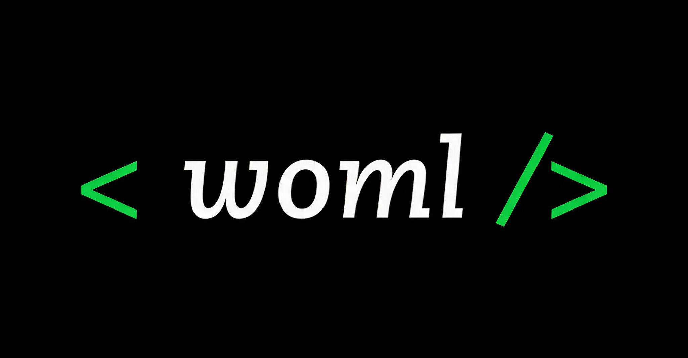
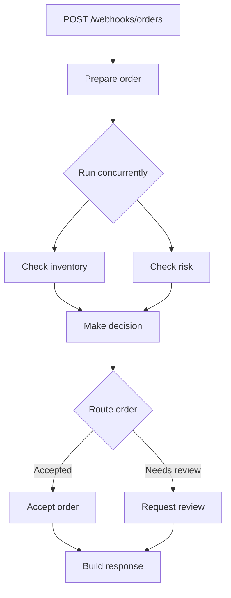
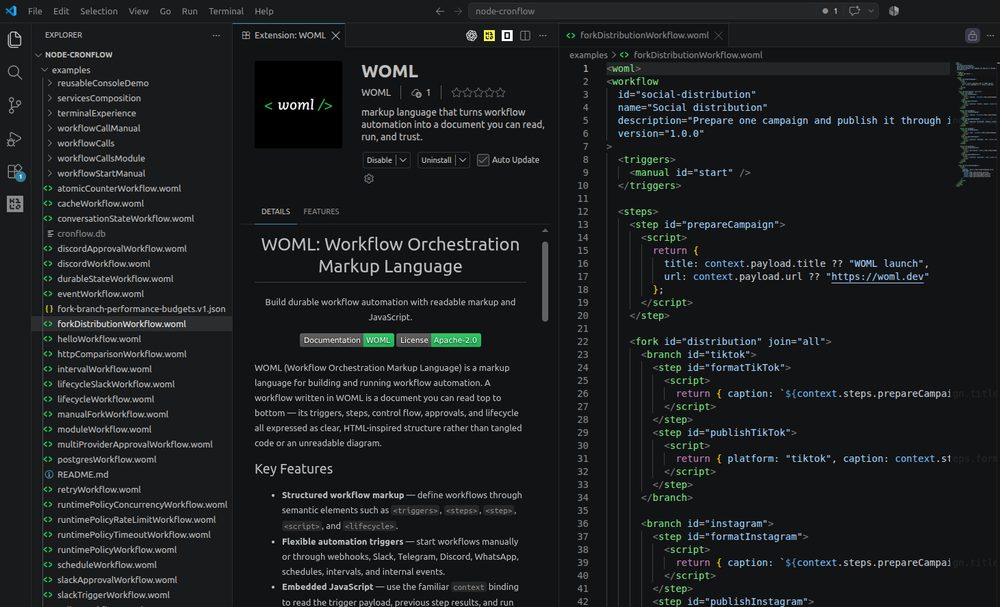

<div align="center">

# WOML: Workflow Orchestration Markup Language



### If you can read HTML, you can use WOML to automate anything, literally anything.

[](https://www.npmjs.com/package/woml-cli)
[](https://github.com/dali-benothmen/woml)
[](./LICENSE)
[]()

</div>

## What is WOML?

WOML is an open, executable format for durable workflow applications. It lets you describe a workflow with readable, HTML-inspired markup, implement custom logic with JavaScript, and run the result through a cross-platform, Rust-powered runtime.

WOML is three things working together:

- **A language** for expressing triggers, steps, data flow, loops, decisions, parallel work, approvals, lifecycle hooks, and runtime policies.
- **A durable engine** for supervising attempts, retries, state, events, workflow calls, recovery, and execution history.
- **An operational runtime** for running, inspecting, cancelling, backing up, and managing automations from the command line.

A `.woml` file is more than configuration. It is the program, the architecture diagram, the execution policy, and the human-readable documentation for an automation—all in one source-controlled document.

When a step needs logic, write JavaScript directly inside `<script>`. WOML handles everything around that code: execution order, durable history, concurrency, external capabilities, human approval, recovery, and production operation.

> **The idea:** an automation should not have to be abandoned and rewritten as a backend service when it becomes important. With WOML, it can begin as a small workflow and grow into durable software without changing its fundamental model.

## Why WOML?

Visual workflow builders are excellent for getting started, but large automations can become difficult to review, reuse, and maintain. Traditional orchestration frameworks are powerful, but their workflow structure is often hidden inside application code and framework APIs.

WOML occupies the space between them: readable like a document, expressive like code, and operated like a durable system.

- **Understandable** — semantic markup makes the complete automation visible from top to bottom.
- **Programmable** — JavaScript, TypeScript modules, and managed services handle logic beyond markup.
- **Version controlled** — workflows are ordinary files with meaningful diffs, pull requests, and CI validation.
- **Durable** — the event-sourced runtime records decisions, attempts, waits, results, and failures.
- **Composable** — workflows can call or start other workflows and reuse project-owned modules, steps, and providers.
- **AI-friendly** — coding agents can generate WOML, validate it with the real compiler, and leave a workflow humans can review.
- **Self-hosted** — run the same workflow on your machine, server, container, or infrastructure without per-step platform billing.

## What WOML Unlocks

### For developers

Workflows become real software artifacts. You can write them in VS Code, keep them in Git, review them in pull requests, validate them in CI, compose them with JavaScript or TypeScript modules, and run them without opening a visual editor. An automation can grow in complexity without forcing a rewrite into a separate backend application.

### For automation

WOML goes beyond connecting one application to another. It can coordinate long-running business processes, concurrent work, data pipelines, human decisions, reusable child workflows, and event-driven systems while preserving durable history and operational control.

Runtime policies live beside the workflow: retries, concurrency, rate limits, queues, timeouts, lifecycle hooks, cancellation, and recovery are part of the executable contract rather than instructions someone must remember later.

### For AI agents

WOML gives people and agents a shared language. Tags constrain the workflow structure, JavaScript provides familiar implementation power, `woml check` catches invalid output, and Git exposes exactly what the agent changed.

WOML can also orchestrate AI systems themselves. An LLM or tool call can run as a supervised step, specialist agents can become child workflows, durable state can preserve knowledge between runs, events can coordinate independent agents, and human approval can guard sensitive actions.

## What Can You Build?

| Area | Examples |
| --- | --- |
| **Business processes** | Customer onboarding, order fulfillment, invoice processing, compliance review |
| **AI agents** | Support agents, research agents, content systems, human-supervised autonomous operations |
| **Data workflows** | Import, validate, transform, classify, iterate over, and store data |
| **Backend automation** | Webhook processing, scheduled jobs, event-driven services, workflow APIs |
| **Human operations** | Approval chains, moderation, escalation, incident response |
| **Communication systems** | Telegram, Discord, Slack, and WhatsApp-driven workflows |
| **Developer automation** | Deployment checks, backups, reports, repository and filesystem operations |
| **Automation products** | Domain-specific workflow platforms built on the WOML language and runtime |

## Installation

WOML requires [Bun](https://bun.sh/) 1.3.14 or later. Install the global CLI with npm:

```bash
npm install --global woml-cli
```

Or install it with Bun or pnpm:

```bash
bun add --global woml-cli
pnpm add --global woml-cli
```

All three commands install the same `woml` executable:

```bash
woml --version
```

Native engines are selected automatically for supported macOS, Linux, and Windows systems. You do not need to install the platform packages or configure a database manually.

Linux packages require glibc 2.31 or newer.

## Quick Start: Build an Order Router

Create a file named `order-router.woml`:

```xml
<woml>
  <workflow
    id="order-router"
    name="Order Router"
    description="Check inventory and risk concurrently, then route the order."
    version="1.0.0"
  >
    <triggers>
      <webhook
        id="newOrder"
        path="/webhooks/orders"
        method="POST"
        auth="none"
      >
        <schema>
          {
            "type": "object",
            "required": ["orderId", "amount", "inStock", "riskScore"],
            "properties": {
              "orderId": { "type": "string" },
              "amount": { "type": "number" },
              "inStock": { "type": "boolean" },
              "riskScore": { "type": "number" }
            },
            "additionalProperties": false
          }
        </schema>
      </webhook>
    </triggers>

    <steps>
      <step
        id="prepareOrder"
        name="Prepare order"
        description="Normalize the order received by the webhook."
      >
        <script>
          return {
            orderId: context.payload.orderId,
            amount: context.payload.amount
          };
        </script>
      </step>

      <parallel
        id="orderChecks"
        name="Run order checks"
        description="Check inventory and risk at the same time."
        concurrency="2"
        on-error="wait-all"
      >
        <step
          id="inventoryCheck"
          name="Check inventory"
          description="Confirm that the requested item is available."
        >
          <script>
            return { available: context.payload.inStock };
          </script>
        </step>

        <step
          id="riskCheck"
          name="Check risk"
          description="Accept orders with a risk score below seventy."
        >
          <script>
            return {
              approved: context.payload.riskScore < 70,
              score: context.payload.riskScore
            };
          </script>
        </step>
      </parallel>

      <step
        id="canFulfill"
        name="Make decision"
        description="Combine the inventory and risk results."
      >
        <script>
          return {
            value:
              context.steps.inventoryCheck.available &&
              context.steps.riskCheck.approved
          };
        </script>
      </step>

      <choose
        id="orderRoute"
        name="Route order"
        description="Accept the order or send it for review."
      >
        <when test="{{context.steps.canFulfill.value}}">
          <step id="acceptOrder" name="Accept order">
            <script>
              return {
                status: "accepted",
                message: `Order ${context.steps.prepareOrder.orderId} is ready for fulfillment.`
              };
            </script>
          </step>
          <result value="{{context.steps.acceptOrder}}" />
        </when>

        <otherwise>
          <step id="reviewOrder" name="Request review">
            <script>
              return {
                status: "review",
                message: `Order ${context.steps.prepareOrder.orderId} needs review.`
              };
            </script>
          </step>
          <result value="{{context.steps.reviewOrder}}" />
        </otherwise>
      </choose>

      <step
        id="response"
        name="Build response"
        description="Publish one predictable result for the caller."
      >
        <script>
          return {
            orderId: context.steps.prepareOrder.orderId,
            amount: context.steps.prepareOrder.amount,
            ...context.steps.orderRoute
          };
        </script>
      </step>
    </steps>
  </workflow>
</woml>
```

Check it without starting the automation:

```bash
woml check order-router.woml
```

Then run it:

```bash
woml run order-router.woml
```

WOML keeps the automation active and prints its webhook URL together with a generated `curl` command. Trigger it from another terminal:

```bash
curl --request POST http://127.0.0.1:3000/webhooks/orders \
  --header 'content-type: application/json' \
  --data '{"orderId":"order-42","amount":240,"inStock":true,"riskScore":18}'
```

Use `auth="none"` only for local development. Configure authenticated webhooks before exposing an endpoint outside a trusted environment.

## How the Workflow Runs



## See the Result

WOML presents each run as an organized, colored terminal report. You will see output like this:

```text
RUN  run_8f21c4                                                Order Router

  ✓  Prepare order                                              3 ms
     Normalize the order received by the webhook.
     → { orderId: "order-42", amount: 240 }

  ✓  Check inventory                                            2 ms
     → { available: true }

  ✓  Check risk                                                 2 ms
     → { approved: true, score: 18 }

  ✓  Make decision                                              1 ms
     → { value: true }

  ✓  Accept order                                               1 ms
     → { status: "accepted", message: "Order order-42 is ready for fulfillment." }

  ✓  Build response                                             1 ms
     → { orderId: "order-42", amount: 240, status: "accepted" }

Completed in 10 ms · 6 succeeded
```

The exact run ID and timings will differ. Press <kbd>Ctrl</kbd>+<kbd>C</kbd> to stop the active automation.

## What You Just Built

- **`<webhook>`** validated an HTTP request and created a durable workflow run.
- **`context.payload`** exposed the validated trigger input to every script.
- **`<parallel>`** ran two independent checks concurrently and waited for both.
- **`context.steps.<id>`** made completed step results available downstream.
- **`<choose>`** selected one route and published a stable merged result.
- **The terminal experience** showed each step, result, duration, and final outcome.

## More “Aha” Examples

Every example below is checked against the current WOML compiler.

| Build                                                           | What it demonstrates                                                  | Run                                               |
| --------------------------------------------------------------- | --------------------------------------------------------------------- | ------------------------------------------------- |
| [Durable run counter](./examples/durableStateWorkflow.woml)     | State that survives future runs and process restarts                  | `woml run examples/durableStateWorkflow.woml`     |
| [Personalize a customer list](./examples/forEachWorkflow.woml)  | Durable per-item execution, bounded concurrency, and ordered results   | `woml run examples/forEachWorkflow.woml`          |
| [Social distribution](./examples/forkDistributionWorkflow.woml) | Several independent multi-step branches with an explicit join         | `woml run examples/forkDistributionWorkflow.woml` |
| [Telegram approval](./examples/telegramApprovalWorkflow.woml)   | Human approval, interactive notification buttons, and durable waiting | `woml run examples/telegramApprovalWorkflow.woml` |
| [Workflow composition](./examples/workflowCallManual/)          | One workflow calling another and using its returned result            | `woml run examples/workflowCallManual`            |
| [Local TypeScript module](./examples/moduleWorkflow.woml)       | Reusable project code exposed through `services.*`                    | `woml run examples/moduleWorkflow.woml`           |

Provider examples require their documented credentials. Browse the [complete example catalog](./examples/) for webhooks, schedules, intervals, internal events, databases, storage, cache, lifecycle, retries, communication providers, and production deployment.

## Key Features

- **Readable workflow files** — author automation with semantic, HTML-inspired markup.
- **Embedded JavaScript** — use `context.payload`, `context.steps`, `attempt`, `services`, and explicitly referenced `secrets` inside scripts.
- **Production triggers** — manual, webhook, schedule, interval, internal event, Slack, Telegram, Discord, and WhatsApp.
- **Structured control flow** — sequential steps, durable bounded item loops, parallel groups, choices, switches, and concurrent multi-step forks with explicit joins.
- **Retries and idempotency** — declare retry behavior with the `retry` attribute while preserving durable attempt and operation identities.
- **Human-in-the-loop** — pause durably for approval and continue through approved or rejected routes.
- **Managed capabilities** — use supervised HTTP, SQLite/PostgreSQL, storage, cache, state, events, workflow calls, and communication services.
- **Reusable building blocks** — import local JavaScript or TypeScript modules and define reusable WOML steps or notification providers.
- **Lifecycle and runtime policy** — observe workflow and step events while controlling concurrency, rate limits, queues, and timeouts.
- **Production operations** — run in the foreground or background, inspect activity, follow logs, cancel runs, back up state, and prune old history.
- **Cross-platform runtime** — install one CLI that selects the appropriate native Rust engine automatically.

## WOML vs Alternatives

Most workflow tools optimize for either visual simplicity or engineering power. WOML is designed to keep both: readable workflow structure for the whole team and real JavaScript whenever the automation needs it.

| Tool                                                                                                                   | How you build workflows | Readable by the whole team                   | Self-hosted |             Logic without a ceiling             |
| ---------------------------------------------------------------------------------------------------------------------- | ----------------------- | -------------------------------------------- | :---------: | :---------------------------------------------: |
| **WOML**                                                                                                               | **Markup + JavaScript** | ✅ **Clear, document-like structure**        |     ✅      | ✅ **Inline JavaScript, modules, and services** |
| [n8n](https://docs.n8n.io/)                                                                                            | Visual canvas           | ⚠️ Easy at first; harder as the canvas grows |     ✅      |            ⚠️ Code and custom nodes             |
| [Zapier](https://help.zapier.com/hc/en-us/articles/16722578092429-Use-the-editor-to-build-and-view-your-Zap-workflows) | Visual canvas           | ⚠️ Friendly for smaller automations          |     ❌      |       ⚠️ Platform actions and code steps        |
| [Temporal](https://docs.temporal.io/)                                                                                  | Code with language SDKs | ❌ Primarily readable by engineers           |     ✅      |          ✅ Full programming languages          |
| [AWS Step Functions](https://docs.aws.amazon.com/step-functions/latest/dg/concepts-amazon-states-language.html)        | JSON/YAML with ASL      | ❌ Requires ASL and AWS knowledge            |     ❌      | ⚠️ Extended through AWS services and functions  |
| [Apache Airflow](https://airflow.apache.org/docs/apache-airflow/stable/tutorial/fundamentals.html)                     | Python DAGs             | ❌ Primarily readable by Python/data teams   |     ✅      |             ✅ Python and operators             |

> **WOML's difference:** it combines document-like readability, self-hosted ownership, and full JavaScript flexibility in the same workflow file.

## Common Commands

```bash
woml check workflows/                    # Parse, validate, and compile
woml run workflows/                      # Activate workflows in the foreground
woml run workflows/ --background         # Activate them in the background
woml inspect                             # Open the colored runtime inspector
woml list                                # List workflows and recent runs
woml get run_...                         # Inspect one run and its event history
woml cancel run_...                      # Cancel a pending or running workflow
woml workflow-id --logs                  # Follow logs for a workflow
woml secrets set API_TOKEN               # Store a secret without printing it
woml backup backups/latest               # Back up the durable state store
woml prune --before 30d --dry-run        # Preview retention cleanup
```

See the [CLI reference](./docs/cli-reference.md) for all commands, flags, exit behavior, and machine-readable output.

## VS Code Experience

The [WOML extension](./woml-vscode/) gives `.woml` files HTML-style markup highlighting, embedded JavaScript syntax, highlighted runtime bindings such as `context` and `services`, reference-expression highlighting, snippets, and a dedicated file icon.

<div align="center">
  
</div>

The extension follows your existing VS Code theme instead of requiring a separate WOML color theme.

## Let AI Build Your Workflows

Describe the automation you want in plain language and let your coding agent turn it into readable, validated WOML. The **WOML Skill** teaches AI agents the language structure, runtime bindings, control-flow patterns, services, secrets, and validation workflow they need to create real `.woml` files without inventing syntax.

```text
Use the WOML workflow skill to build an order-processing automation that starts
from a webhook, checks inventory and risk concurrently, and routes the result.
```

Install it once in your project or personal agent skills directory, then ask for workflows naturally or invoke `$woml` explicitly.

For Claude Code, install the complete skill in the current project:

```bash
mkdir -p .claude/skills/woml
curl -fsSL https://github.com/dali-benothmen/woml/releases/latest/download/woml-skill.tar.gz \
  | tar -xz -C .claude/skills/woml
```

For Codex and other clients that use the Agent Skills project convention:

```bash
mkdir -p .agents/skills
cp -R skills/woml .agents/skills/woml
```

**[View the WOML Skill and installation guide →](./skills/woml/)**

## Documentation and Examples

- [Getting started](./docs/getting-started.md)
- [Language reference](./docs/language-reference.md)
- [CLI reference](./docs/cli-reference.md)
- [Services and capabilities](./docs/woml-services.md)
- [Modules](./docs/woml-modules.md)
- [Communication providers](./docs/woml-communication-providers.md)
- [Production deployment](./docs/woml-production-deployment.md)
- [Complete example catalog](./examples/)

## Support and Security

Use [GitHub Discussions](https://github.com/dali-benothmen/woml/discussions) for questions and [GitHub Issues](https://github.com/dali-benothmen/woml/issues) for reproducible bugs. Follow the [support guide](./SUPPORT.md) when sharing diagnostics, and report vulnerabilities privately according to the [security policy](./SECURITY.md).

## Contributing

Contributions are welcome, including bug reports, documentation improvements, tested examples, provider work, compiler changes, and runtime improvements. Read [CONTRIBUTING.md](./CONTRIBUTING.md) before opening a pull request.

## License

WOML is released under the [Apache License 2.0](./LICENSE).
