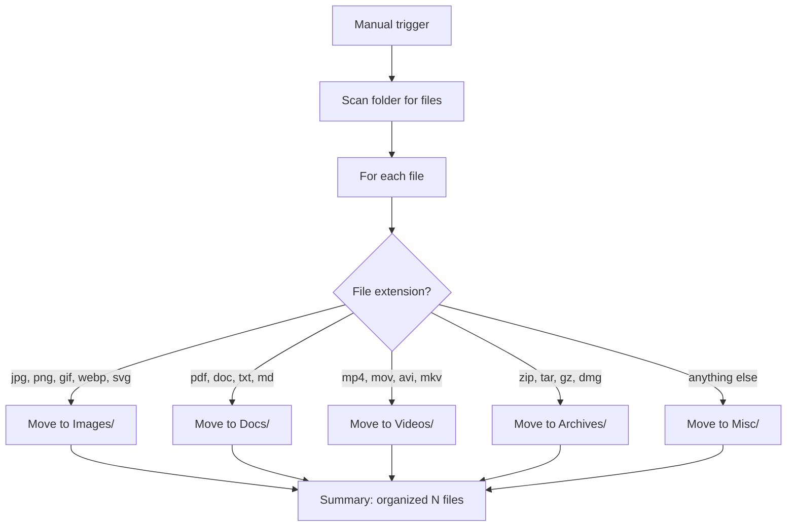

<div align="center">

# WOML: Workflow Orchestration Markup Language


### If you can read HTML, you can use WOML to automate anything, literally anything.

<!-- WOML banner image placeholder: ./docs/assets/banner.png -->

[](https://www.npmjs.com/package/woml-cli)
[](https://github.com/dali-benothmen/woml)
[](./LICENSE)
[]()

</div>

---

WOML is a markup language for building and running workflow automation. A workflow written in WOML is a document you can read top to bottom — its triggers, steps, control flow, approvals, and lifecycle all expressed as clear, HTML-inspired structure instead of tangled code or an unreadable diagram.

When a step needs real logic, JavaScript is always available inside `<script>` — so there is no ceiling on what a workflow can do. WOML handles everything _around_ that code: execution order, retries, concurrency, human approvals, external services, and a durable, inspectable history of every run. The result is automation that scales without becoming spaghetti, that your whole team can read, and that you can actually trust in production.

## Why another automation tool?

Five nodes in n8n or Zapier feels like magic. Twenty nodes feels like a crime scene.

The canvas turns into spaghetti, a single run takes a lifetime, and the moment the built-in integrations fall short you end up stuffing JavaScript into a tiny textbox in a browser UI — no version control, no code review, no idea what changed last Tuesday.

WOML takes a different bet: your workflow is **a file**. It reads like HTML, so anyone on the team can follow it. Every step can run real JavaScript with any npm package, so you never hit a wall. It lives in git, so every change is a diff and a review. And the engine underneath is Rust, so it stays fast when your workflows get big — because big workflows are exactly what WOML is built for.

## Why WOML

- **Readable as a document.** A workflow is structure you can read, diff, and review — not a canvas of boxes and wires that turns into spaghetti as it grows.
- **No ceiling.** Common actions are clean tags; when you need real logic, drop into `<script>` with full JavaScript and any npm package. Automate anything — literally anything.
- **Triggers for everything.** Manual, webhook, schedule, interval, event, Slack, Telegram, Discord, and WhatsApp — and you can build your own providers for anything else.
- **Built to run in production.** Durable run history, retries, concurrency, lifecycle hooks, and a fold-from-events core mean you can always see what happened, track down errors, and replay it.
- **Human-in-the-loop.** Pause a workflow for approvals with real notifications and durable waiting.
- **Modular.** Reusable step definitions, local modules, and workflows that call other workflows.
- **Fast core.** The execution engine is written in Rust for speed and reliability under load.
- **Free and runs anywhere.** Open source, self-hosted, runs on macOS, Linux, and Windows.

## Installation

```bash
npm i --g woml-cli
```

Or with Bun:

```bash
bun add --global woml-cli
```

This installs the `woml` command:

```bash
woml --version
```

**Requirements:** macOS (x64, arm64), Linux (x64, glibc), or Windows (x64, arm64). No database to set up — the default state store is bundled.

## Quick example: organize your Downloads folder

Run this once and it sorts every file in a folder into the right place — images, documents, videos, archives — using conditional logic, a real filesystem loop, and zero external services.

```xml
<woml>
  <workflow id="organize" name="Organize a folder by file type">
    <triggers>
      <manual id="start" />
    </triggers>

    <steps>
      <step id="scan">
        <script>
          const { promises: fs } = await import('fs');
          const path = await import('path');
          const folder = context.payload.path ?? '.';
          const entries = await fs.readdir(folder, { withFileTypes: true });
          return {
            folder,
            files: entries
              .filter(e => e.isFile())
              .map(e => ({ name: e.name, ext: path.extname(e.name).toLowerCase() })),
          };
        </script>
      </step>

      <for-each id="organize" source="{{context.steps.scan.files}}">
        <step id="classify">
          <script>
            return { ext: context.item.ext };
          </script>
        </step>

        <choose>
          <when test="{{context.steps.classify.ext in ['.jpg', '.jpeg', '.png', '.gif', '.webp', '.svg']}}">
            <step id="move-image">
              <script>
                const { promises: fs } = await import('fs');
                const path = await import('path');
                const from = path.join(context.steps.scan.folder, context.item.name);
                const to = path.join(context.steps.scan.folder, 'Images', context.item.name);
                await fs.mkdir(path.dirname(to), { recursive: true });
                await fs.rename(from, to);
                return { movedTo: 'Images' };
              </script>
            </step>
          </when>
          <when test="{{context.steps.classify.ext in ['.pdf', '.doc', '.docx', '.txt', '.md', '.rtf']}}">
            <step id="move-doc">
              <script>
                const { promises: fs } = await import('fs');
                const path = await import('path');
                const from = path.join(context.steps.scan.folder, context.item.name);
                const to = path.join(context.steps.scan.folder, 'Docs', context.item.name);
                await fs.mkdir(path.dirname(to), { recursive: true });
                await fs.rename(from, to);
                return { movedTo: 'Docs' };
              </script>
            </step>
          </when>
          <when test="{{context.steps.classify.ext in ['.mp4', '.mov', '.avi', '.mkv', '.webm']}}">
            <step id="move-video">
              <script>
                const { promises: fs } = await import('fs');
                const path = await import('path');
                const from = path.join(context.steps.scan.folder, context.item.name);
                const to = path.join(context.steps.scan.folder, 'Videos', context.item.name);
                await fs.mkdir(path.dirname(to), { recursive: true });
                await fs.rename(from, to);
                return { movedTo: 'Videos' };
              </script>
            </step>
          </when>
          <when test="{{context.steps.classify.ext in ['.zip', '.tar', '.gz', '.7z', '.rar', '.dmg']}}">
            <step id="move-archive">
              <script>
                const { promises: fs } = await import('fs');
                const path = await import('path');
                const from = path.join(context.steps.scan.folder, context.item.name);
                const to = path.join(context.steps.scan.folder, 'Archives', context.item.name);
                await fs.mkdir(path.dirname(to), { recursive: true });
                await fs.rename(from, to);
                return { movedTo: 'Archives' };
              </script>
            </step>
          </when>
          <otherwise>
            <step id="move-misc">
              <script>
                const { promises: fs } = await import('fs');
                const path = await import('path');
                const from = path.join(context.steps.scan.folder, context.item.name);
                const to = path.join(context.steps.scan.folder, 'Misc', context.item.name);
                await fs.mkdir(path.dirname(to), { recursive: true });
                await fs.rename(from, to);
                return { movedTo: 'Misc' };
              </script>
            </step>
          </otherwise>
        </choose>
      </for-each>

      <step id="summary">
        <script>
          const total = context.steps.scan.files.length;
          return { message: `Organized ${total} file(s) into Images/, Docs/, Videos/, Archives/, Misc/.` };
        </script>
      </step>
    </steps>
  </workflow>
</woml>
```

Save it as `organize.woml` and run it:

```bash
woml run organize.woml --payload '{"path":"/path/to/Downloads"}'
```

WOML scans the folder, loops over every file with `<for-each>`, routes each one through a `<choose>` decision by extension, and moves it into the right subfolder with `fs.rename`. Press Ctrl+C to stop the run.



This is one WOML file. No setup, no cloud, no API keys. It runs locally, pulls in real npm packages (`fs`, `path`) on demand, and exercises the same primitives that make n8n workflows become spaghetti and Zapier workflows impossible: `<choose>` for conditional routing, `<for-each>` for iteration, and `<script>` for the parts that need real code.

## Real workflows in WOML

Four triggers, four real automations. Each is a complete, runnable workflow.

**Webhook — flag risky orders and alert Slack:**

```xml
<woml>
  <workflow id="order-guard">
    <triggers>
      <webhook id="order" path="/webhooks/orders" method="POST"
               secret="{{secrets.ORDER_WEBHOOK_TOKEN}}">
        <schema>
          {
            "type": "object",
            "required": ["orderId", "total", "customerId"],
            "properties": {
              "orderId": { "type": "string" },
              "total": { "type": "number" },
              "customerId": { "type": "string" }
            }
          }
        </schema>
      </webhook>
    </triggers>
    <steps>
      <step id="risk">
        <script>
          const customer = await services.http.request({
            method: 'GET',
            url: `https://internal.api/customers/${context.payload.customerId}`,
            timeoutMs: 5000
          });
          return { flagged: context.payload.total > 10000 || customer.body.disputes > 0 };
        </script>
      </step>
    </steps>
    <choose>
      <when test="context.steps.risk.flagged">
        <step id="alert">
          <script>
            await services.slack.send({
              channel: '#fraud',
              text: `High-risk order ${context.payload.orderId} ($${context.payload.total}) needs review.`
            });
            return { alerted: true };
          </script>
        </step>
      </when>
    </choose>
  </workflow>
</woml>
```

**Schedule — a daily sales report, every weekday at 9am:**

```xml
<woml>
  <workflow id="daily-report">
    <triggers>
      <schedule id="weekdays" cron="0 9 * * MON-FRI" timezone="UTC" />
    </triggers>
    <steps>
      <step id="totals">
        <script>
          const rows = await services.database.query({
            sql: "SELECT COUNT(*) AS orders, COALESCE(SUM(total), 0) AS revenue FROM orders WHERE created_at >= date('now', '-1 day')",
            parameters: []
          });
          return rows[0];
        </script>
      </step>
      <step id="publish">
        <script>
          const { orders, revenue } = context.steps.totals;
          await services.slack.send({
            channel: '#sales',
            text: `Daily report — ${orders} orders, $${revenue.toFixed(2)} revenue.`
          });
          return { sent: true };
        </script>
      </step>
    </steps>
  </workflow>
</woml>
```

**Telegram — answer `/sales` from your team chat:**

```xml
<woml>
  <workflow id="telegram-sales">
    <triggers>
      <telegram id="ask" events="message" commands="/sales"
                bot-token="{{secrets.TELEGRAM_BOT_TOKEN}}" />
    </triggers>
    <steps>
      <step id="lookup">
        <script>
          const rows = await services.database.query({
            sql: "SELECT COUNT(*) AS today FROM orders WHERE created_at >= date('now')",
            parameters: []
          });
          return { today: rows[0].today };
        </script>
      </step>
      <step id="notify">
        <script>
          await services.slack.send({
            channel: '#sales',
            text: `Today's numbers were requested on Telegram: ${context.steps.lookup.today} orders so far.`
          });
          return { ok: true };
        </script>
      </step>
    </steps>
  </workflow>
</woml>
```

**Event — send a confirmation email whenever another workflow emits `order.created`:**

```xml
<woml>
  <workflow id="order-confirmation">
    <triggers>
      <event id="created" name="order.created" secret="{{secrets.EVENT_CONTROL_TOKEN}}">
        <schema>
          {
            "type": "object",
            "required": ["orderId", "email"],
            "properties": {
              "orderId": { "type": "string" },
              "email": { "type": "string" }
            }
          }
        </schema>
      </event>
    </triggers>
    <steps>
      <step id="confirm">
        <script>
          await services.http.request({
            method: 'POST',
            url: 'https://api.emailprovider.com/v1/send',
            headers: { authorization: `Bearer ${secrets.EMAIL_API_KEY}` },
            body: {
              to: context.payload.email,
              template: 'order-confirmation',
              data: { orderId: context.payload.orderId }
            },
            timeoutMs: 5000
          });
          return { sentTo: context.payload.email };
        </script>
      </step>
    </steps>
  </workflow>
</woml>
```

Every script gets explicit runtime bindings — `context.payload` (trigger input), `context.steps.<id>` (earlier step output), `services.*` (supervised capabilities like HTTP, database, Slack, storage, cache), and `secrets.*` (only the secrets proven necessary at compile time). Scripts return JSON-compatible values; the Rust engine records every outcome durably.

**→ [Browse all examples](./examples/)**

## WOML vs alternatives

| Tool           | How you write it    | Readable by the whole team    | Self-hosted | No ceiling |
| -------------- | ------------------- | ----------------------------- | ----------- | ---------- |
| **WOML**       | Markup + JavaScript | ✅                            | ✅          | ✅         |
| n8n            | Visual canvas       | ⚠️ Until it becomes spaghetti | ✅          | ❌         |
| Zapier         | Visual canvas       | ⚠️ Until it becomes spaghetti | ❌          | ❌         |
| Temporal       | Code (TS/Go/Java)   | ❌                            | ✅          | ✅         |
| Step Functions | JSON (ASL)          | ❌                            | ❌          | ⚠️         |
| Airflow        | Python DAGs         | ❌                            | ✅          | ✅         |

WOML is the only one that combines all three: readable as markup, free and self-hosted, and unlimited in what it can express.

## What WOML includes

- Manual, webhook, schedule, interval, event, Slack, Telegram, Discord, and WhatsApp triggers.
- Sequential steps, retries, parallel groups, choices, switches, and forked multi-step branches.
- Durable approvals with provider notifications and shared decisions.
- Workflow and step lifecycle hooks.
- Built-in HTTP, SQL database, storage, cache, event, durable-state, messaging, and workflow call/start services.
- Local JavaScript/TypeScript modules, reusable WOML steps, and custom notification providers.
- Runtime concurrency, rate-limit, queue, and timeout policies.
- Foreground and background operation, run inspection, log following, backup, recovery, and retention.
- A VS Code extension with HTML-style markup and embedded JavaScript syntax.

## Common commands

```bash
woml check workflows/                    # Validate workflows without running them
woml run workflows/                      # Run in the foreground (Ctrl+C to stop)
woml run workflows/ --background         # Run in the background, survives Ctrl+C
woml inspect                             # Show the current state of all runs
woml list                                # List known workflows and recent runs
woml get run_...                         # Print the full event history of a run
woml cancel run_...                      # Cancel a running or pending run
woml backup backups/latest               # Snapshot the durable state store to a file
woml prune --before 30d --dry-run        # Preview which old runs would be purged
```

See the [CLI reference](docs/cli-reference.md) for every command and option.

## Documentation

Full documentation — language reference, all tags, triggers, control flow, services, modules, and production deployment — lives in the docs.

**→ [Read the full documentation](./docs/README.md)**

## Support and security

Use [GitHub Discussions](https://github.com/dali-benothmen/woml/discussions) for questions and [GitHub Issues](https://github.com/dali-benothmen/woml/issues) for reproducible bugs. Please report vulnerabilities privately according to the [security policy](SECURITY.md).

## Contributing

Contributions are welcome — bug reports, feature ideas, docs, or a custom provider. See [CONTRIBUTING.md](./CONTRIBUTING.md) to get started.

## License

WOML is released under the [Apache License 2.0](./LICENSE).
