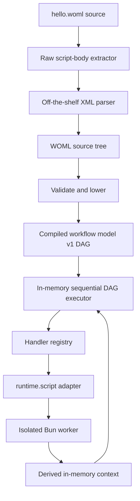

# WOML CLI Vertical Slice Implementation Plan

Status: Phases 0–5 complete; the packaged CLI journey is verified; the
temporary TypeScript executor was retired in Rust integration R6
Target: `woml run hello.woml` parses, compiles, and executes a real WOML
workflow through the TypeScript frontend, Rust engine, and Bun workers
Scope: the smallest end-to-end implementation that proves the WOML syntax and
the language-neutral compiled workflow model are compatible

## 1. Outcome

The first WOML implementation will be a vertical slice with one public user
journey:

```bash
woml run hello.woml
```

That command will:

1. Read the WOML source file.
2. Parse its markup while preserving raw JavaScript inside `<script>`.
3. Validate the supported v0.1 subset.
4. Lower the source tree into the versioned compiled workflow DAG.
5. Execute the DAG sequentially in memory.
6. Run script nodes in isolated Bun workers with an injected read-only
   `context` binding.
7. Make the second script read the first script's output through
   `context.steps.a.x`.
8. Print the only terminal step's JSON return and exit successfully.

The slice is complete only when the installed package exposes the `woml`
executable and the exact command above works. A parser demo, compiler-only test,
or executor called directly from a test does not satisfy the outcome.

## 2. Concrete Acceptance Workflow

The checked-in example will be:

```xml
<workflow
  version="0.1"
  id="hello"
  name="Hello WOML">

  <triggers>
    <manual id="start" />
  </triggers>

  <steps>
    <step
      id="a"
      name="Choose greeting name"
      description="Use the trigger name or default to World">
      <script>
        const name = context.trigger.name ?? "World";

        return {
          x: name
        };
      </script>
    </step>

    <step id="b">
      <script>
        return {
          message: `Hello ${context.steps.a.x}`
        };
      </script>
    </step>
  </steps>
</workflow>
```

For `woml run hello.woml`, the manual-trigger payload is an empty JSON
object. Step `a` therefore returns:

```json
{
  "x": "World"
}
```

Step `b` reads `context.steps.a.x` through the injected JavaScript `context`
binding and returns:

```json
{
  "message": "Hello World"
}
```

The CLI writes the only terminal step's result as compact JSON followed by one
line feed to stdout. A successful run writes nothing to stderr:

```text
stderr: <empty>
stdout: {"message":"Hello World"}
exit:   0
```

## 3. Architectural Shape



The important boundaries are:

- The parser knows WOML markup and raw `<script>` bodies.
- The compiler knows WOML and emits the language-neutral DAG.
- The executor receives only the compiled model; it never receives or walks the
  WOML tree.
- The registry maps opaque handler IDs to runtime adapters.
- The milestone registers exactly one executable handler: `runtime.script`.
- The script adapter owns JavaScript execution and the Bun worker boundary.
- `context` is workflow data. It does not contain services, clients, secrets,
  executor controls, or mutable engine state.

The compiled model remains a DAG from the first slice. The executor is merely
allowed to choose one ready node at a time, so later parallel scheduling will
not require changing the compiler-to-core interface.

## 4. Decisions Locked for the Slice

### 4.1 Public command and naming

- The executable is named `woml`.
- Its first command is `woml run <file.woml>`.
- The WOML library will live in the new top-level `woml/` folder.
- The public CLI will live in the new top-level `woml-cli/` folder and consume
  the WOML library rather than duplicating parsing, compilation, or execution.
- No public `cronflow` object or command is introduced.
- Renaming the existing npm package, SDK exports, repository metadata, and old
  examples is outside this slice.

### 4.2 Parser strategy

The markup tree will be produced by `fast-xml-parser` in ordered mode. An
off-the-shelf XML parser alone cannot safely accept ordinary raw JavaScript such
as `score < 0.8 && enabled`, because those characters have XML meaning.

A narrow WOML raw-content pass will therefore run first:

1. Locate `<script>` opening tags in markup mode.
2. Capture everything up to the matching literal `</script>` without parsing or
   rewriting the JavaScript.
3. Replace each body with a unique XML-safe placeholder.
4. Parse and validate the masked markup with `fast-xml-parser` while preserving
   child order and attributes.
5. Restore the exact captured script source into the source tree.

This is a raw-body lexer, not a new XML parser. Markup, attributes, nesting,
comments, and self-closing elements remain the library's responsibility.

For this slice, the first literal `</script>` terminates the raw body. Authors
must not place that exact sequence inside a JavaScript string, comment, or
template literal. The rule will be recorded in `docs/woml-v0.1.md` and covered
by diagnostics; a JavaScript-aware closing-tag scanner is deferred.

Parser configuration will preserve order, preserve attributes as strings,
disable automatic number/boolean coercion, and retain script whitespace. This
prevents the XML library from silently deciding WOML types.

The raw-content pass and parser normalization also produce source spans. Every
source node records its original start/end byte offsets; a line index converts
those offsets to one-based line and column positions. XML-safe placeholders
carry an explicit offset map, so an error inside or after a masked script never
points into generated parser input.

### 4.3 Supported source subset

The compiler accepts only:

- One `<workflow>` root with required `id`, plus optional non-empty `version`,
  `name`, and `description` attributes. `version` identifies the workflow
  itself; it does not select a WOML language version. Other workflow attributes
  are staged.
- One `<triggers>` container with exactly one `<manual id="..." />` trigger.
- One `<steps>` container with one or more sequential `<step>` elements.
- A required unique `id` and optional non-empty `name` and `description`
  attributes on every step.
- Exactly one `<script>` operation per step.
- Lowercase kebab-case workflow IDs and JavaScript-safe lower-camel trigger and
  step IDs, as frozen in `docs/woml-v0.1.md`.
- No `context.run`, retry, timeout, declarative capability operation, or other
  frozen-but-staged feature.

Every recognized but unsupported v0.1 feature produces a clear
"unsupported in the vertical slice" validation error. It is never ignored.
Unknown elements and attributes are validation errors.

### 4.4 Compiled model

The compiler targets
`docs/schemas/compiled-workflow-model.v1.schema.json`. For the acceptance file,
the semantic result is:

- One compiled manual-trigger descriptor. `woml run` activates it directly; it
  uses descriptor handler ID `trigger.manual` with an empty object config. It is
  not registered or executed as a workflow-node handler.
- Node `a` handler: `runtime.script`.
- Node `a` metadata: `name` is `Choose greeting name` and `description` is
  `Use the trigger name or default to World`.
- Node `b` handler: `runtime.script`.
- Entry node: `a`.
- One unconditional edge named `a-to-b`: `a -> b`.
- Each `runtime.script` node receives an object input with one `source` field;
  that field is an opaque literal containing the exact raw script body.

The model contains no XML nodes, moustache strings, WOML tag names, callbacks,
or parsed JavaScript AST. The core-facing handler and value-expression shapes
remain language-neutral.

### 4.5 Context contract

The first runtime context is:

```ts
type WorkflowContext = Readonly<{
  trigger: JsonObject;
  steps: Readonly<Record<string, JsonValue>>;
}>;
```

`context.run` is deliberately absent until its public schema is approved.
`services` is also absent from the first executable profile. Capability-backed
script bindings are introduced only with the later capability/RAK milestone.

Execution rules:

- `context.trigger` is `{}` for `woml run hello.woml`.
- Before node `a`, `context.steps` is empty.
- A script receives a structured-cloned, deeply frozen snapshot.
- A successful JSON return from node `a` is added at `context.steps.a`.
- Node `b` receives a new snapshot containing the output from `a`.
- Script mutations, local variables, globals, functions, and clients never
  become context.
- An output is published only after its handler succeeds.
- Non-JSON results, including `undefined`, functions, symbols, `BigInt`, and
  circular objects, fail the node.

The in-memory context is a disposable projection. Later event persistence will
replace direct output publication with `event -> fold -> context` without
changing the script-facing shape.

### 4.6 Frozen reference grammar versus script context access

Phase 0 freezes the future WOML attribute-reference grammar with no internal
whitespace:

```text
reference     := "{{" path "}}"
path          := "context.trigger" ("." property-id)*
               | "context.steps." step-id ("." property-id)*
step-id       := [a-z][A-Za-z0-9]*
property-id   := [A-Za-z_$][A-Za-z0-9_$]*
```

For example, a later reference-bearing tag may compile
`{{context.steps.a.x}}` into:

```json
{
  "kind": "contextReference",
  "path": ["steps", "a", "x"]
}
```

That grammar is frozen but not executable in this walking skeleton because the
executable tag set contains no reference-bearing attributes. The milestone does
not add a declarative operation merely to consume it and does not implement the
runtime `contextReference` resolver yet.

The data dependency exercised now is ordinary JavaScript:

```js
context.steps.a.x
```

Rules that are pinned now for later staged features:

- A future compiler verifies that a referenced step ID exists and dominates the
  consuming node.
- A missing nested property is a runtime reference error, not an empty string.
- Exact references preserve their JSON type.
- Mixed templates are staged even though model v1 can represent them.
- Bracket notation, escaping, optional references, and fallback expressions are
  deferred.

### 4.7 Bun script execution

The CLI process runs on Bun and acts as the host for the duration of one
workflow run. Each `runtime.script` invocation creates a fresh Bun worker:

- The worker receives the script source and context snapshot through structured
  cloning.
- It constructs an async function whose explicit argument is `context`.
- Top-level `await` in the script body works because the body is executed as an
  async function.
- The result or a serialized error is posted back to the host.
- The worker is terminated after the invocation.

No script scope is reused between nodes. This preserves the chosen architecture
of a reusable Bun host with isolated invocation contexts, while keeping the
first executor simple.

This worker provides per-invocation state and cancellation boundaries, not a
security sandbox or a separate operating-system process. The vertical slice
executes trusted local WOML only. Resource
limits, permissions, untrusted-code hardening, and production timeout control
are later work.

### 4.8 Executor behavior

The executor will:

1. Verify that the compiled graph is acyclic, node and edge IDs are unique,
   every endpoint and entry node exists, entry nodes have no incoming edges,
   and every node is reachable.
2. Initialize the manual trigger context.
3. Find ready nodes from DAG dependencies.
4. Select one ready node deterministically in compiled node order.
5. Resolve the node's value-expression inputs against the current context.
6. Invoke the registered handler.
7. Validate and publish the JSON result under the node ID.
8. Continue until all reachable nodes finish or one fails.
9. Require exactly one terminal node for this CLI profile and return the final
   context plus that terminal node's result.

The executor must not special-case WOML tags. Its only script-specific knowledge
is the registered `runtime.script` adapter.

## 5. Scope and Non-Goals

Included:

- `.woml` file loading.
- Raw `<script>` body preservation without CDATA.
- Strict validation of the accepted subset.
- Lowering to the versioned DAG model.
- Manual trigger with an empty payload.
- Sequential scheduling of compiled nodes.
- A handler registry containing only `runtime.script`.
- Read-only `context` injection into JavaScript.
- Direct data access from the second script through `context.steps.a.x`.
- JSON output validation.
- A package-installed `woml` executable.
- Unit, compiler-contract, and end-to-end CLI tests.

Explicitly deferred:

- Rust-core integration or refactoring under `core/`.
- Existing TypeScript SDK migration or changes under `sdk/`.
- Persistence, event sourcing, replay, recovery, and run history.
- Retry, timeout policy, idempotency, and exactly-once claims.
- Schedule, interval, webhook, and event trigger activation.
- Parallel, branch, approval, lifecycle, configuration, and queues.
- Services, secrets, RAK, database, HTTP, Slack, and capability packages.
- Executing `{{context...}}` references, mixed templates, and declarative
  attribute inputs.
- External trigger input flags, interactive prompts, and environment loading.
- Production sandboxing, resource accounting, and daemonized Bun hosts.
- Publishing or renaming the existing npm package.

Deferral does not permit silent behavior. A source file using any deferred WOML
construct must fail validation with a specific unsupported-feature message.
The language document may describe designed constructs, but the CLI advertises
and publishes only the executable profile listed here.

## 6. Historical Vertical-Slice Repository Changes

This layout records the temporary Phase 0–5 implementation. Rust integration
R6 later deleted the `woml` execution modules and moved the JSON/Worker
primitives still required by Rust into `woml-cli/src/script-host/`. The current
source tree, rather than this historical layout, is authoritative.

```text
package.json                                      # declare the two packages/workspaces when implementation starts
hello.woml                                       # Phase 0 acceptance workflow

woml/                                            # WOML library: source to compiled DAG, plus slice runtime
  package.json                                   # library package and fast-xml-parser dependency
  bun.lock                                       # exact Phase 1 dependency resolution
  tsconfig.json                                  # isolated strict type-check configuration
  src/index.ts                                   # public WOML library exports
  src/source.ts                                  # source-tree types, spans, and diagnostics
  src/raw-content.ts                             # exact script extraction/restoration
  src/parser.ts                                  # XML parser configuration and normalization
  src/compiler.ts                                # tag validation and DAG lowering
  src/model.ts                                   # TypeScript view of compiled-model v1
  src/executor.ts                                # in-memory ready-node loop and context projection
  src/handlers.ts                                # registry containing runtime.script only
  src/script-runner.ts                           # host-side Bun worker adapter
  src/script-worker.ts                           # isolated async script invocation
  src/json.ts                                    # strict JSON boundary validation, cloning, and freezing
  src/runtime-error.ts                           # execution error codes and failing-node identity
  tests/parser.test.ts                           # raw body and structural parsing tests
  tests/compiler.test.ts                         # validation and exact lowering tests
  tests/executor.test.ts                         # context threading and handler behavior
  tests/fixtures/hello.compiled.v1.json          # Phase 0 compiled target
  tests/fixtures/hello.context.v0.1.json         # Phase 0 context snapshots

woml-cli/                                        # public command package; depends on woml/
  package.json                                   # woml binary and CLI build
  bun.lock                                       # exact CLI development dependency resolution
  tsconfig.json                                  # isolated strict type-check configuration
  src/cli.ts                                     # argument parsing and run command
  tests/cli.test.ts                              # spawned command end-to-end test
  tests/fixtures/hello.cli.v0.1.json             # Phase 0 process contract

docs/woml-v0.1.md                                # language and executable-profile contract
docs/schemas/compiled-workflow-model.v1.schema.json
                                                   # reviewed frontend-to-core model
```

`core/` and `sdk/` are intentionally untouched in this milestone. The frontend
and CLI will compile against the already-reviewed language-neutral boundary so
the vertical slice can reveal whether that boundary is sufficient before the
production executor is converged in Rust.

## 7. Implementation Phases and Gates

### Phase 0 — Close blocking decisions and pin the target fixture

Phase 0 produces decisions and fixtures only. It adds no dependency, parser,
compiler, executor, worker, CLI, or other executable code. Executable
implementation begins in Phase 1.

Decisions to close:

- Freeze raw-content termination: the first literal `</script>` closes a raw
  script body, and that exact sequence is forbidden inside the body in v0.1.
- Freeze the JavaScript-safe identifier grammar and the staged
  `{{context...}}` reference grammar. The reference grammar is not executed by
  this milestone because the executable set contains no reference-bearing tag.
- Freeze the executable set as exactly `<workflow>`, `<triggers>`, `<manual>`,
  `<steps>`, `<step>`, and `<script>`, plus static validation for those elements.
- Freeze `name` and `description` as optional attributes—not child tags—on
  workflow and step elements in this executable profile.
- Classify every other frozen syntax construct as runtime-staged. It must fail
  with `WOML_FEATURE_NOT_EXECUTABLE` in this profile; it is never ignored or
  assigned weaker semantics.
- Make `context.run` unavailable in v0.1. The injected context contains only
  `context.trigger` and `context.steps`.
- Freeze package ownership: `woml/` owns the reusable WOML library and the
  vertical-slice runtime; `woml-cli/` owns only the public command and depends
  on `woml/`. Neither package makes `core/` understand WOML tags or XML.
- Freeze the first CLI result rule: its compiled DAG must have exactly one
  terminal node, and that node's JSON result is written to stdout.

Fixtures and contracts to pin:

- Check in the exact `hello.woml` shown in Section 2.
- Write `woml/tests/fixtures/hello.compiled.v1.json` by hand as the reviewed
  semantic target before implementing the compiler.
- Pin the compiled trigger, two `runtime.script` nodes, entry node, and
  `a-to-b` unconditional edge; node `b` is the only terminal node.
- Pin the optional step metadata lowering as `node.metadata.name` and
  `node.metadata.description` through node `a` in the compiled fixture.
- Pin the in-memory context shape before `a`, after `a`, and after `b` in
  `woml/tests/fixtures/hello.context.v0.1.json`.
- Pin the command, empty trigger payload, exact stdout including its trailing
  line feed, empty stderr, and exit status `0` in
  `woml-cli/tests/fixtures/hello.cli.v0.1.json`.

Gate:

- The language decisions, WOML fixture, compiled-model fixture, context
  snapshots, stdout, stderr, and exit code have been reviewed together.
- There are no unresolved parser or identifier decisions.
- No executable implementation file has been added or changed in this phase.

### Phase 1 — Parse WOML into a source tree — complete

Work:

- Add `fast-xml-parser`.
- Build raw `<script>` extraction/restoration using the Phase 0 terminator rule.
- Normalize the ordered XML result into small typed source nodes.
- Reject malformed markup, duplicate attributes, declarations, multiple roots,
  and unclosed raw scripts.
- Preserve script text exactly.
- Attach original source spans to every normalized node and retain offset maps
  across raw-body masking.
- Implement raw-content behavior only for `<script>`; staged raw elements such
  as webhook `<schema>` receive no runtime/parser feature implementation in this
  milestone.

Gate:

- A parser test proves that a script containing `<`, `>`, `&&`, template
  literals, and ordinary JavaScript is returned unchanged.
- A malformed element before, inside, and after a raw script reports the correct
  original file, line, and column.
- `hello.woml` produces the expected ordered source tree.
- No compiler or executor is required to pass this gate.

### Phase 2 — Validate and lower to the DAG — complete

Work:

- Validate exactly the executable profile: `<workflow>`, `<triggers>`, one
  `<manual>`, `<steps>`, sequential `<step>` elements, and one `<script>` per
  step.
- Accept and lower optional workflow and step `name`/`description` attributes as
  descriptive compiled metadata.
- Enforce required and unique IDs and one operation per step.
- Reject every frozen-but-staged construct with
  `WOML_FEATURE_NOT_EXECUTABLE` and its source location.
- Compile sequential document order into explicit unconditional edges.
- Compile every step to the single handler ID `runtime.script`, with its script
  source carried as an opaque literal input.
- Lower optional step `name` and `description` to the same keys in node
  `metadata`.
- Run graph semantic checks after lowering: acyclicity, unique node/edge IDs,
  valid endpoints and entries, full reachability, and exactly one terminal node
  for the first CLI profile.

Gate:

- The compiled output for `hello.woml` deep-equals the reviewed JSON fixture.
- The fixture satisfies every compiled-model invariant used by the slice.
- Unknown and staged constructs fail before execution.
- Empty `<steps>`, invalid IDs, duplicate IDs, missing required children, and
  multiple operations report stable diagnostic codes and source locations.
- No Bun worker or handler has been required to prove the compiler gate.

### Phase 3 — Resolve script inputs and execute the DAG — complete

Work:

- Resolve only the literal/object compiled inputs needed by `runtime.script`.
  Do not implement `contextReference` or mixed-template evaluation yet.
- Add the handler registry with exactly one registered executable handler:
  `runtime.script`.
- Add the Bun worker script runner and JSON-result validation.
- Add the sequential ready-node executor and in-memory context projection.
- Inject a read-only context snapshot containing `trigger` and prior `steps`
  outputs into each script invocation.

Gate:

- Step `a` reads `context.trigger` and returns `{ "x": "World" }`.
- The successful result becomes `context.steps.a` before `b` starts.
- Step `b` reads `context.steps.a.x` directly in JavaScript and returns
  `{ "message": "Hello World" }`.
- A script exception, unknown handler, invalid graph, or non-JSON result fails
  deterministically without publishing a partial step output.
- The executor consumes only the compiled model and never the WOML source tree.

### Phase 4 — Expose `woml run` — complete

Work:

- Add a Bun shebang CLI entry point.
- Parse exactly `woml run <path>` and validate the `.woml` file exists.
- Connect file loading, parsing, compiling, execution, and output formatting.
- Add a `bin.woml` package entry and CLI-specific build output.
- Keep normal errors concise; include the failing phase and source path.

Gate:

- After building and linking/installing the package, the shell resolves `woml`.
- `woml run hello.woml` prints the agreed output and exits `0`.
- Invalid WOML and script failure exit nonzero without a success JSON result.
- A successful run writes nothing to stderr.

### Phase 5 — Verify the real package journey — complete

Work:

- Use the reviewed root `hello.woml` fixture pinned in Phase 0.
- Add focused unit tests and one spawned CLI test.
- Build the package exactly as a user would receive it.
- Link or install that build into an isolated temporary directory.
- Run the public command from that directory, not from a TypeScript test import.

Gate:

```bash
bun install
bun run build
bun link
woml run hello.woml
```

The final gate checks:

- stderr is empty.
- stdout parses as JSON and equals `{"message":"Hello World"}`.
- exit status is `0`.
- no SQLite database, run-state file, cache file, or generated workflow artifact
  appears beside the source.

Implementation note: this deferred gate was completed during Rust integration
R5. The packed `woml-cli` artifact was installed into a clean temporary Bun
project, its public `node_modules/.bin/woml` executable ran the reviewed
`hello.woml` through the packaged Rust addon, and the source directory remained
unchanged.

## 8. Verification Matrix

| Layer | Required proof |
|---|---|
| Raw content | JavaScript with XML-significant characters survives byte-for-byte. |
| Markup parser | Child order, repeated steps, attributes, self-closing tags, and original source spans are retained. |
| Validation | Unknown tags, duplicate IDs, multiple operations, and staged features fail early with stable locations. |
| Compiler | `hello.woml` lowers to two DAG nodes and one unconditional edge; the result is acyclic and fully reachable. |
| Context threading | The second script reads the first script's successful output through `context.steps.a.x`. |
| Script runner | `context` is available, `await` works, state is not shared, and only JSON returns cross the worker boundary. |
| Executor | Outputs appear only after success and the next node sees prior outputs. |
| CLI | Public binary, file errors, parse errors, runtime errors, stdout, stderr, and exit codes behave as specified. |
| End to end | A packaged executable runs `hello.woml` from a fresh temporary directory. |

## 9. Error Contract

Every author-facing failure uses the public diagnostic shape frozen in
`docs/woml-v0.1.md`:

```ts
type WomlDiagnostic = {
  code: string;
  phase: "parse" | "validation" | "compile" | "runtime";
  message: string;
  file: string;
  location: {
    start: { line: number; column: number; offset: number };
    end?: { line: number; column: number; offset: number };
  };
  hint?: string;
};
```

The first implementation includes specific codes for malformed markup, an
unclosed raw body, unknown or unsupported elements, missing attributes,
duplicate IDs, invalid IDs, invalid DAGs, unknown handlers, script failures, and
non-JSON results. It does not collapse every failure into one generic parse or
runtime code.

The normal CLI rendering is:

```text
hello.woml:14:5 [WOML_FEATURE_NOT_EXECUTABLE] <parallel> is frozen but not executable in this runtime profile
```

Every message includes the original `.woml` location. Stack traces and internal
worker details are hidden by default; when a precise Bun script location can be
translated safely, it is mapped back into the script body's WOML coordinates.
Bad CLI usage or an unreadable path is a CLI error rather than a WOML source
diagnostic because no valid source location exists.

## 10. Risks and Containment

### Raw JavaScript versus XML

Risk: testing only XML-safe JavaScript would create a false success and later
force CDATA or escaping.

Containment: the first parser test deliberately includes `<` and `&&`; raw-body
extraction is implemented before the XML parser is accepted.

### Prototype executor becoming a second permanent core

Risk: the TypeScript in-memory executor could evolve into another overlapping
execution path.

Containment: it consumes only the compiled model, has no persistence or trigger
server, and is limited to the vertical-slice registry. Its interfaces are the
test harness for replacing scheduling with the converged core later.

### Source syntax leaking into the compiled model

Risk: WOML tag names or XML/source-tree nodes could be passed to the executor
for convenience.

Containment: compiler fixture tests require typed value expressions and opaque
handler IDs. The executor package has no dependency on parser/source-tree types.

### Context becoming authoritative mutable state

Risk: direct in-memory assignment could accidentally define the future durable
model.

Containment: scripts receive immutable snapshots; results publish only after
success; the executor exposes a projection boundary that event folding can
replace later.

### Worker isolation being mistaken for security

Risk: users may assume arbitrary WOML scripts are safe to run.

Containment: documentation labels the slice trusted-local-only, and no security
or exactly-once claim is made.

## 11. Definition of Done

The vertical slice is done when all of the following are true:

- `hello.woml` contains a manual trigger and two sequential steps.
- One step executes raw JavaScript through Bun.
- That JavaScript reads the injected `context` keyword.
- The successful return is available at `context.steps.a`.
- The next script reads `context.steps.a.x` directly through the injected
  JavaScript context.
- The compiler emits a version-1 DAG, not a linear source-only structure.
- The executor consumes only the compiled model.
- The package exposes the `woml` executable.
- `woml run hello.woml` produces the exact reviewed output.
- Parser, compiler, worker, executor, and CLI tests pass.
- Parse, validation, compile, and runtime failures carry a stable code, original
  line/column, and useful message.
- Unsupported features fail explicitly.
- No persistence or legacy SDK execution path is involved.

## 12. What Comes Immediately After

Only after this gate passes will the result be reviewed for the next layer. The
review will use concrete evidence from the slice to decide the order of:

1. Converging the production core onto the compiled-model executor contract.
2. Replacing the in-memory projection with versioned events and one fold.
3. Turning the one-run Bun host into the long-lived host lifecycle while keeping
   one isolated worker context per invocation.
4. Expanding the WOML compiler in thin vertical increments: trigger inputs,
   mixed templates, lifecycle, parallel, and approval. Branch cannot enter an
   executable profile until its stable merged-output syntax and lowering target
   are approved.
5. Adding capability registries and later migrating the TypeScript SDK to emit
   the same compiled model.

None of those tasks are prerequisites for proving `woml run hello.woml`.
