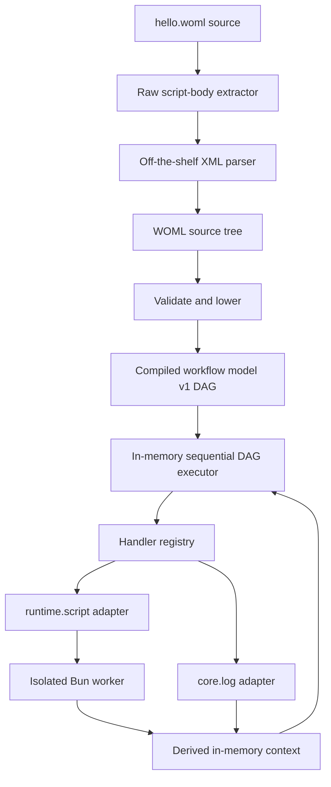

# WOML CLI Vertical Slice Implementation Plan

Status: proposed for review
Target: `woml run hello.woml` parses, compiles, and executes a real WOML
workflow through Bun
Scope: the smallest end-to-end implementation that proves the WOML syntax and
the language-neutral compiled workflow model are compatible

## 1. Outcome

The first WOML implementation will be a vertical slice with one public user
journey:

```bash
woml run hello.woml
```

That command will:

1. Read the WOML source file.
2. Parse its markup while preserving raw JavaScript inside `<script>`.
3. Validate the supported v0.1 subset.
4. Lower the source tree into the versioned compiled workflow DAG.
5. Execute the DAG sequentially in memory.
6. Run script nodes in isolated Bun workers with an injected read-only
   `context` binding.
7. Resolve one `{{context.steps...}}` attribute reference for a declarative
   handler.
8. Print the last step's JSON result and exit successfully.

The slice is complete only when the installed package exposes the `woml`
executable and the exact command above works. A parser demo, compiler-only test,
or executor called directly from a test does not satisfy the outcome.

## 2. Concrete Acceptance Workflow

The checked-in example will be:

```xml
<workflow
  woml-version="0.1"
  id="hello"
  name="Hello WOML">

  <triggers>
    <manual id="start" />
  </triggers>

  <steps>
    <step id="a">
      <script>
        const name = context.trigger.name ?? "World";

        return {
          message: `Hello ${name}`
        };
      </script>
    </step>

    <step id="b">
      <log message="{{context.steps.a.message}}" />
    </step>
  </steps>
</workflow>
```

For `woml run hello.woml`, the manual-trigger payload is an empty JSON
object. Step `a` therefore returns:

```json
{
  "message": "Hello World"
}
```

Step `b` receives the exact referenced value, writes `Hello World` as a log
line, and returns:

```json
{
  "message": "Hello World"
}
```

The CLI writes workflow logs to stderr and writes only the last step result as
JSON to stdout. This keeps stdout deterministic and usable by another command:

```text
stderr: Hello World
stdout: {"message":"Hello World"}
exit:   0
```

`<log>` is the one small declarative operation included in the slice. It is not
an integration package: it is a built-in handler used to prove that a WOML
attribute reference can lower to a typed value expression and be resolved at
runtime. It maps to the existing compiled-model handler example `core.log`.

## 3. Architectural Shape



The important boundaries are:

- The parser knows WOML markup and raw `<script>` bodies.
- The compiler knows WOML and emits the language-neutral DAG.
- The executor receives only the compiled model; it never receives or walks the
  WOML tree.
- The registry maps opaque handler IDs to runtime adapters.
- The script adapter owns JavaScript execution and the Bun worker boundary.
- `context` is workflow data. It does not contain services, clients, secrets,
  executor controls, or mutable engine state.

The compiled model remains a DAG from the first slice. The executor is merely
allowed to choose one ready node at a time, so later parallel scheduling will
not require changing the compiler-to-core interface.

## 4. Decisions Locked for the Slice

### 4.1 Public command and naming

- The executable is named `woml`.
- Its first command is `woml run <file.woml>`.
- No public `cronflow` object or command is introduced.
- Renaming the existing npm package, SDK exports, repository metadata, and old
  examples is outside this slice.

### 4.2 Parser strategy

The markup tree will be produced by `fast-xml-parser` in ordered mode. An
off-the-shelf XML parser alone cannot safely accept ordinary raw JavaScript such
as `score < 0.8 && enabled`, because those characters have XML meaning.

A narrow WOML raw-content pass will therefore run first:

1. Locate `<script>` opening tags in markup mode.
2. Capture everything up to the matching literal `</script>` without parsing or
   rewriting the JavaScript.
3. Replace each body with a unique XML-safe placeholder.
4. Parse and validate the masked markup with `fast-xml-parser` while preserving
   child order and attributes.
5. Restore the exact captured script source into the source tree.

This is a raw-body lexer, not a new XML parser. Markup, attributes, nesting,
comments, and self-closing elements remain the library's responsibility.

For this slice, the first literal `</script>` terminates the raw body. Authors
must not place that exact sequence inside a JavaScript string, comment, or
template literal. The rule will be recorded in `docs/woml-v0.1.md` and covered
by diagnostics; a JavaScript-aware closing-tag scanner is deferred.

Parser configuration will preserve order, preserve attributes as strings,
disable automatic number/boolean coercion, and retain script whitespace. This
prevents the XML library from silently deciding WOML types.

The raw-content pass and parser normalization also produce source spans. Every
source node records its original start/end byte offsets; a line index converts
those offsets to one-based line and column positions. XML-safe placeholders
carry an explicit offset map, so an error inside or after a masked script never
points into generated parser input.

### 4.3 Supported source subset

The compiler accepts only:

- One `<workflow>` root with `woml-version="0.1"`, required `id`, and optional
  workflow metadata attributes.
- One `<triggers>` container with exactly one `<manual id="..." />` trigger.
- One `<steps>` container with one or more sequential `<step>` elements.
- A required unique `id` on every step.
- Exactly one operation per step: `<script>` or `<log>`.
- A required `message` attribute on `<log>`.
- An exact `{{context...}}` reference in `<log message>`.
- Lowercase kebab-case workflow IDs and JavaScript-safe lower-camel trigger and
  step IDs, as frozen in `docs/woml-v0.1.md`.
- No `context.run`, retry greater than one, timeout, or designed-only feature.

Every recognized but unsupported v0.1 feature produces a clear
"unsupported in the vertical slice" validation error. It is never ignored.
Unknown elements and attributes are validation errors.

### 4.4 Compiled model

The compiler targets
`docs/schemas/compiled-workflow-model.v1.schema.json`. For the acceptance file,
the semantic result is:

- Manual trigger handler: `core.manual`.
- Node `a` handler: `runtime.script`.
- Node `b` handler: `core.log`.
- Entry node: `a`.
- One unconditional edge: `a -> b`.
- Script source stored as an opaque literal handler input.
- Log message stored as a `contextReference` value expression with path
  `['steps', 'a', 'message']`.

The model contains no XML nodes, moustache strings, WOML tag names, callbacks,
or parsed JavaScript AST. The core-facing handler and value-expression shapes
remain language-neutral.

### 4.5 Context contract

The first runtime context is:

```ts
type WorkflowContext = Readonly<{
  trigger: JsonObject;
  steps: Readonly<Record<string, JsonValue>>;
}>;
```

`context.run` is deliberately absent until its public schema is approved.

Execution rules:

- `context.trigger` is `{}` for `woml run hello.woml`.
- Before node `a`, `context.steps` is empty.
- A script receives a structured-cloned, deeply frozen snapshot.
- A successful JSON return from node `a` is added at `context.steps.a`.
- Node `b` receives a new snapshot containing the output from `a`.
- Script mutations, local variables, globals, functions, and clients never
  become context.
- An output is published only after its handler succeeds.
- Non-JSON results, including `undefined`, functions, symbols, `BigInt`, and
  circular objects, fail the node.

The in-memory context is a disposable projection. Later event persistence will
replace direct output publication with `event -> fold -> context` without
changing the script-facing shape.

### 4.6 Reference contract

The slice accepts exact references with no internal whitespace:

```text
reference     := "{{" path "}}"
path          := "context.trigger" ("." property-id)*
               | "context.steps." step-id ("." property-id)*
step-id       := [a-z][A-Za-z0-9]*
property-id   := [A-Za-z_$][A-Za-z0-9_$]*
```

For `{{context.steps.a.message}}`, compilation produces:

```json
{
  "kind": "contextReference",
  "path": ["steps", "a", "message"]
}
```

Rules:

- The compiler verifies that a referenced step ID exists and is an earlier
  dependency of the consuming node.
- The compiler cannot verify `message` without an output schema; the resolver
  checks that property at runtime.
- A missing runtime property is an error, not `undefined` and not an empty
  string.
- Exact references preserve their JSON type.
- Mixed templates such as `Hello {{context.steps.a.message}}` are deferred from
  the slice, even though the compiled schema can represent them.
- Bracket notation, escaping, optional references, and fallback expressions are
  deferred.

### 4.7 Bun script execution

The CLI process runs on Bun and acts as the host for the duration of one
workflow run. Each `runtime.script` invocation creates a fresh Bun worker:

- The worker receives the script source and context snapshot through structured
  cloning.
- It constructs an async function whose explicit argument is `context`.
- Top-level `await` in the script body works because the body is executed as an
  async function.
- The result or a serialized error is posted back to the host.
- The worker is terminated after the invocation.

No script scope is reused between nodes. This preserves the chosen architecture
of a reusable Bun host with isolated invocation contexts, while keeping the
first executor simple.

This worker is process isolation for state and cancellation boundaries, not a
security sandbox. The vertical slice executes trusted local WOML only. Resource
limits, permissions, untrusted-code hardening, and production timeout control
are later work.

### 4.8 Executor behavior

The executor will:

1. Verify that the compiled graph is acyclic, node and edge IDs are unique,
   every endpoint and entry node exists, entry nodes have no incoming edges,
   and every node is reachable.
2. Initialize the manual trigger context.
3. Find ready nodes from DAG dependencies.
4. Select one ready node deterministically in compiled node order.
5. Resolve the node's value-expression inputs against the current context.
6. Invoke the registered handler.
7. Validate and publish the JSON result under the node ID.
8. Continue until all reachable nodes finish or one fails.
9. Return the final context and the last executed node's result.

The executor must not special-case WOML tags. Its only script-specific knowledge
is the registered `runtime.script` adapter.

## 5. Scope and Non-Goals

Included:

- `.woml` file loading.
- Raw `<script>` body preservation without CDATA.
- Strict validation of the accepted subset.
- Lowering to the versioned DAG model.
- Manual trigger with an empty payload.
- Sequential scheduling of compiled nodes.
- `runtime.script` and `core.log` handler adapters.
- Exact typed context references.
- Read-only `context` injection into JavaScript.
- JSON output validation.
- A package-installed `woml` executable.
- Unit, compiler-contract, and end-to-end CLI tests.

Explicitly deferred:

- Rust-core integration or refactoring under `core/`.
- Existing TypeScript SDK migration or changes under `sdk/`.
- Persistence, event sourcing, replay, recovery, and run history.
- Retry, timeout policy, idempotency, and exactly-once claims.
- Schedule, interval, webhook, and event trigger activation.
- Parallel, branch, approval, lifecycle, configuration, and queues.
- Services, secrets, RAK, database, HTTP, Slack, and capability packages.
- Mixed templates and the complete reference grammar.
- External trigger input flags, interactive prompts, and environment loading.
- Production sandboxing, resource accounting, and daemonized Bun hosts.
- Publishing or renaming the existing npm package.

Deferral does not permit silent behavior. A source file using any deferred WOML
construct must fail validation with a specific unsupported-feature message.
The language document may describe designed constructs, but the CLI advertises
and publishes only the executable profile listed here.

## 6. Planned Repository Changes

```text
package.json                                  # add parser dependency, CLI build, and woml bin
src/cli.ts                                   # argument parsing and run command
src/woml/source.ts                           # source-tree types, spans, and diagnostics
src/woml/raw-content.ts                      # exact script extraction/restoration
src/woml/parser.ts                           # XML library configuration and tree normalization
src/woml/references.ts                       # reference parse, compile, and runtime resolution
src/woml/compiler.ts                         # subset validation and DAG lowering
src/woml/model.ts                            # TypeScript view of compiled-model v1
src/woml/executor.ts                         # in-memory ready-node loop and context projection
src/woml/handlers.ts                         # registry plus core.manual/core.log adapters
src/woml/script-runner.ts                    # host-side Bun worker adapter
src/woml/script-worker.ts                    # isolated async script invocation
hello.woml                                  # acceptance workflow
tests/woml/parser.test.ts                    # raw body and structural parsing tests
tests/woml/compiler.test.ts                  # validation and exact lowering tests
tests/woml/references.test.ts                # typed and invalid reference tests
tests/woml/executor.test.ts                  # context threading and handler behavior
tests/woml/cli.test.ts                       # spawned command end-to-end test
docs/woml-v0.1.md                            # accept core.log and raw terminator rule
docs/schemas/compiled-workflow-model.v1.schema.json
                                              # only if the slice exposes a real schema gap
```

`core/` and `sdk/` are intentionally untouched in this milestone. The frontend
and CLI will compile against the already-reviewed language-neutral boundary so
the vertical slice can reveal whether that boundary is sufficient before the
production executor is converged in Rust.

## 7. Implementation Phases and Gates

### Phase 0 — Freeze the executable subset

Work:

- Add `<log message="..." />` to the fundamental syntax as the first built-in
  declarative operation.
- Record exact-reference-only behavior for this slice.
- Record the literal `</script>` raw-body terminator restriction.
- Freeze workflow and structural identifier grammars.
- Make `context.run` explicitly unavailable in v0.1.
- Separate designed syntax from the first executable/publishable CLI profile.
- Freeze the diagnostic object and CLI rendering contract.
- Write the expected compiled model fixture for `hello.woml` before building the
  executor.

Gate:

- The source example, compiled fixture, context shape, handler IDs, stdout,
  stderr, and exit code are reviewable and unambiguous.

### Phase 1 — Parse WOML into a source tree

Work:

- Add `fast-xml-parser`.
- Build raw script extraction/restoration.
- Normalize the ordered XML result into small typed source nodes.
- Reject malformed markup, duplicate attributes, declarations, multiple roots,
  and unclosed raw scripts.
- Preserve script text exactly.
- Attach original source spans to every normalized node and retain offset maps
  across raw-body masking.

Gate:

- A parser test proves that a script containing `<`, `>`, `&&`, template
  literals, and ordinary JavaScript is returned unchanged.
- A malformed element before, inside, and after a raw script reports the correct
  original file, line, and column.
- `hello.woml` produces the expected ordered source tree.

### Phase 2 — Validate and lower to the DAG

Work:

- Validate only the accepted workflow, manual trigger, steps, script, and log
  structures.
- Enforce required and unique IDs and one operation per step.
- Compile sequential document order into explicit unconditional edges.
- Compile scripts to opaque `runtime.script` inputs.
- Compile the log reference to a `contextReference` value expression.
- Run graph semantic checks after lowering: acyclicity, unique node/edge IDs,
  valid endpoints and entries, and full reachability.

Gate:

- The compiled output for `hello.woml` deep-equals the reviewed JSON fixture.
- The fixture satisfies every compiled-model invariant used by the slice.
- Unknown and deferred constructs fail before execution.
- Empty `<steps>`, invalid IDs, missing references, and duplicate nested IDs
  report stable diagnostic codes and source locations.

### Phase 3 — Resolve inputs and execute handlers

Work:

- Implement recursive value-expression resolution for literals, objects, arrays,
  and exact context references already represented by model v1.
- Add the handler registry.
- Add `core.log` with deterministic stderr logging and JSON output.
- Add the Bun worker script runner and JSON-result validation.
- Add the sequential ready-node executor and in-memory context projection.

Gate:

- Step `a` can read `context.trigger` and return JSON.
- Step `b` resolves `context.steps.a.message` from its compiled input.
- A missing property, script exception, unknown handler, or non-JSON result fails
  deterministically without publishing a partial step output.

### Phase 4 — Expose `woml run`

Work:

- Add a Bun shebang CLI entry point.
- Parse exactly `woml run <path>` and validate the `.woml` file exists.
- Connect file loading, parsing, compiling, execution, and output formatting.
- Add a `bin.woml` package entry and CLI-specific build output.
- Keep normal errors concise; include the failing phase and source path.

Gate:

- After building and linking/installing the package, the shell resolves `woml`.
- `woml run hello.woml` prints the agreed output and exits `0`.
- Invalid WOML and script failure exit nonzero without a success JSON result.

### Phase 5 — Verify the real package journey

Work:

- Add the checked-in root `hello.woml` fixture.
- Add focused unit tests and one spawned CLI test.
- Build the package exactly as a user would receive it.
- Link or install that build into an isolated temporary directory.
- Run the public command from that directory, not from a TypeScript test import.

Gate:

```bash
bun install
bun run build
bun link
woml run hello.woml
```

The final gate checks:

- stderr contains `Hello World` once.
- stdout parses as JSON and equals `{"message":"Hello World"}`.
- exit status is `0`.
- no SQLite database, run-state file, cache file, or generated workflow artifact
  appears beside the source.

## 8. Verification Matrix

| Layer | Required proof |
|---|---|
| Raw content | JavaScript with XML-significant characters survives byte-for-byte. |
| Markup parser | Child order, repeated steps, attributes, self-closing tags, and original source spans are retained. |
| Validation | Unknown tags, duplicate IDs, multiple operations, bad references, and deferred features fail early with stable locations. |
| Compiler | `hello.woml` lowers to two DAG nodes and one unconditional edge; the result is acyclic and fully reachable. |
| Reference resolver | Exact reference preserves the original JSON type and missing paths fail. |
| Script runner | `context` is available, `await` works, state is not shared, and only JSON returns cross the worker boundary. |
| Executor | Outputs appear only after success and the next node sees prior outputs. |
| CLI | Public binary, file errors, parse errors, runtime errors, stdout, stderr, and exit codes behave as specified. |
| End to end | A packaged executable runs `hello.woml` from a fresh temporary directory. |

## 9. Error Contract

Every author-facing failure uses the public diagnostic shape frozen in
`docs/woml-v0.1.md`:

```ts
type WomlDiagnostic = {
  code: string;
  phase: "parse" | "validation" | "compile" | "runtime";
  message: string;
  file: string;
  location: {
    start: { line: number; column: number; offset: number };
    end?: { line: number; column: number; offset: number };
  };
  hint?: string;
};
```

The first implementation includes specific codes for malformed markup, an
unclosed raw body, unknown or unsupported elements, missing attributes,
duplicate IDs, invalid IDs, unavailable references, invalid DAGs, unknown
handlers, script failures, and non-JSON results. It does not collapse every
failure into one generic parse or runtime code.

The normal CLI rendering is:

```text
hello.woml:14:18 [WOML_REFERENCE_NOT_AVAILABLE] Step "missing" is not available here
```

Every message includes the original `.woml` location. Stack traces and internal
worker details are hidden by default; when a precise Bun script location can be
translated safely, it is mapped back into the script body's WOML coordinates.
Bad CLI usage or an unreadable path is a CLI error rather than a WOML source
diagnostic because no valid source location exists.

## 10. Risks and Containment

### Raw JavaScript versus XML

Risk: testing only XML-safe JavaScript would create a false success and later
force CDATA or escaping.

Containment: the first parser test deliberately includes `<` and `&&`; raw-body
extraction is implemented before the XML parser is accepted.

### Prototype executor becoming a second permanent core

Risk: the TypeScript in-memory executor could evolve into another overlapping
execution path.

Containment: it consumes only the compiled model, has no persistence or trigger
server, and is limited to the vertical-slice registry. Its interfaces are the
test harness for replacing scheduling with the converged core later.

### Source syntax leaking into the compiled model

Risk: raw moustache strings, tag names, or XML nodes could be passed to the
executor for convenience.

Containment: compiler fixture tests require typed value expressions and opaque
handler IDs. The executor package has no dependency on parser/source-tree types.

### Context becoming authoritative mutable state

Risk: direct in-memory assignment could accidentally define the future durable
model.

Containment: scripts receive immutable snapshots; results publish only after
success; the executor exposes a projection boundary that event folding can
replace later.

### Worker isolation being mistaken for security

Risk: users may assume arbitrary WOML scripts are safe to run.

Containment: documentation labels the slice trusted-local-only, and no security
or exactly-once claim is made.

## 11. Definition of Done

The vertical slice is done when all of the following are true:

- `hello.woml` contains a manual trigger and two sequential steps.
- One step executes raw JavaScript through Bun.
- That JavaScript reads the injected `context` keyword.
- The successful return is available at `context.steps.a`.
- The next step consumes `{{context.steps.a.message}}` through the runtime
  reference resolver.
- The compiler emits a version-1 DAG, not a linear source-only structure.
- The executor consumes only the compiled model.
- The package exposes the `woml` executable.
- `woml run hello.woml` produces the exact reviewed output.
- Parser, compiler, resolver, worker, executor, and CLI tests pass.
- Parse, validation, compile, and runtime failures carry a stable code, original
  line/column, and useful message.
- Unsupported features fail explicitly.
- No persistence or legacy SDK execution path is involved.

## 12. What Comes Immediately After

Only after this gate passes will the result be reviewed for the next layer. The
review will use concrete evidence from the slice to decide the order of:

1. Converging the production core onto the compiled-model executor contract.
2. Replacing the in-memory projection with versioned events and one fold.
3. Turning the one-run Bun host into the long-lived host lifecycle while keeping
   one isolated worker context per invocation.
4. Expanding the WOML compiler in thin vertical increments: trigger inputs,
   mixed templates, lifecycle, parallel, and approval. Branch cannot enter an
   executable profile until its stable merged-output syntax and lowering target
   are approved.
5. Adding capability registries and later migrating the TypeScript SDK to emit
   the same compiled model.

None of those tasks are prerequisites for proving `woml run hello.woml`.
