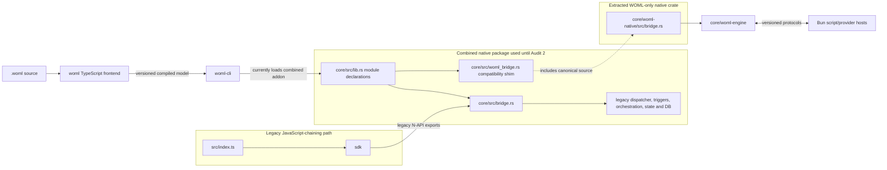

# WOML Legacy Cronflow Core Audit and Removal Map

Status: Audit 0 and Audit 1 completed on 2026-08-15. The dependency and removal
map is frozen, and the canonical WOML N-API adapter now lives in a dedicated
native crate that depends only on `woml-engine`. The CLI packaging switch is
deliberately reserved for Audit 2. No legacy public API, database, fixture, or
user data was removed.

## 1. Executive Conclusion

The WOML runtime does **not** execute workflows through the legacy Cronflow
bridge, dispatcher, trigger executor, step orchestrator, state machine, mutable
context, or database model.

The current coupling is packaging, not execution:

- [`core/woml-engine`](core/woml-engine) is an independent Rust crate and is
  the WOML execution, persistence, recovery, trigger, policy, service, and
  inspection authority.
- [`core/woml-native`](core/woml-native) is the extracted native crate. Its
  canonical adapter at
  [`core/woml-native/src/bridge.rs`](core/woml-native/src/bridge.rs) imports
  `woml_engine`; it does not import the legacy Rust modules.
- [`core/src/woml_bridge.rs`](core/src/woml_bridge.rs) is now a temporary
  compatibility shim that includes the canonical adapter source while the CLI
  still builds the combined addon.
- [`core/src/lib.rs`](core/src/lib.rs) declares both `woml_bridge` and every
  legacy module in one native `core` crate. Consequently, a normal WOML native
  build still compiles and links the legacy implementation even though WOML
  does not call it.
- [`woml-cli/scripts/stage-native.ts`](woml-cli/scripts/stage-native.ts) builds
  that combined crate and renames its platform library to the already
  WOML-facing `woml-core.<platform>-<arch>.node` artifact.
- The WOML frontend and CLI do not import the JavaScript-chaining SDK.

The first required removal action is therefore complete without deleting old
modules. Once Audit 2 makes `woml-cli` build, package, and pass its release gates
against `woml-native`, the temporary shim can leave the combined crate and the
old Rust dependency closure can be retired independently of WOML.

## 2. Audit Scope and Method

This audit covers the paths named in the roadmap:

- JavaScript-chaining SDK and public package entry points;
- legacy Rust N-API bridge;
- dispatcher and job queue;
- trigger manager, trigger executor, and webhook server;
- step orchestrator and workflow state machine;
- mutable context, models, state, and database;
- native-addon build and platform packaging;
- the WOML frontend, CLI, N-API adapter, and engine consumers; and
- legacy tests, generated types, scripts, and persisted-data boundaries.

The conclusions are dependency-backed. They come from static imports, Cargo
manifests, package entry points, native symbol consumers, database schemas, and
test/build commands. Generated build output and `node_modules` were excluded
as sources of architectural truth.

Audit 0 deliberately did not:

- delete or move source files;
- change public exports;
- rename schemas or frozen contract identifiers;
- migrate or delete databases;
- change `woml run`; or
- assume that old users no longer require the `cronflow` package.

## 3. Current Architecture and Dependency Boundary



The shared box is the problem. WOML and Cronflow currently leave the build as
one `.node` library, but their runtime graphs are separate after the exported
N-API symbol is selected.

### 3.1 The current WOML path

```text
.woml source
  -> woml/src/parser.ts
  -> woml/src/compiler.ts
  -> versioned compiled DAG and definition package
  -> woml-cli/src/cli.ts
  -> woml-cli/src/rust-executor.ts
  -> executeWoml*/startWoml*/submitWoml* N-API functions
  -> core/src/woml_bridge.rs compatibility shim until Audit 2
  -> core/woml-native/src/bridge.rs canonical adapter
  -> core/woml-engine
  -> durable WOML event log and folded projections
  -> isolated Bun execution hosts when JavaScript is required
```

The frontend owns WOML markup. Rust receives the compiled model. The Bun hosts
execute JavaScript but do not decide graph progression, retries, durable
admission, or recovery.

### 3.2 The legacy Cronflow path

```text
src/index.ts
  -> sdk/index.ts
  -> sdk/src/cronflow.ts and WorkflowInstance chaining
  -> sdk/src/utils/core-resolver.ts
  -> registerWorkflow/createRun/executeStep/... N-API functions
  -> core/src/bridge.rs
  -> legacy triggers/dispatcher/orchestrator/state machine/state/database
```

The SDK also contains JavaScript-owned scheduling, webhook routing, events,
human-loop state, concurrency, retries, lifecycle hooks, testing, performance,
and workflow execution paths. Those are compatibility implementations for the
old chained API, not components of `woml run`.

## 4. Rust Core Inventory

The classification terms used below are:

- **Keep**: authoritative WOML code.
- **Legacy-only**: not used by the WOML runtime; removable after retirement
  gates are satisfied.
- **Reshape**: contains both build concerns today and must be split before
  deletion.

| Path | Current responsibility | WOML relationship | Classification |
| --- | --- | --- | --- |
| [`core/woml-engine`](core/woml-engine) | Compiled DAG execution, immutable events, folding, SQLite durability, recovery, triggers, approvals, retries, workflow calls, lifecycle, policies, state, services, operations, backup, retention, and presentation | Direct execution authority | **Keep** |
| [`core/woml-native`](core/woml-native) | WOML-only `cdylib`/N-API build owner | Directly depends on adapter libraries and `woml-engine`; no legacy dependency | **Keep; Audit 1 complete** |
| [`core/woml-native/src/bridge.rs`](core/woml-native/src/bridge.rs) | Converts N-API arguments/progress callbacks into `woml-engine` calls and serializes outcomes | Canonical extracted CLI boundary; imports `woml_engine`, not legacy modules | **Keep in WOML native crate** |
| [`core/src/woml_bridge.rs`](core/src/woml_bridge.rs) | Includes the canonical adapter into the combined addon during the transition | Keeps today's CLI build compatible until Audit 2 | **Temporary shim; remove after CLI switch** |
| [`core/src/lib.rs`](core/src/lib.rs) | Declares every legacy module plus the temporary WOML shim; contains legacy core tests and branding | Causes both graphs to compile into the currently staged library | **Reshape**, then remove legacy form |
| [`core/src/bridge.rs`](core/src/bridge.rs) | Legacy N-API facade for workflow registration, run creation, jobs, triggers, steps, hooks, and webhook server | Called by the JS SDK and old N-API tests; not called by WOML | **Legacy-only** |
| [`core/src/models.rs`](core/src/models.rs) | Chained-workflow, step, trigger, run, job, condition, parallel, and completion structures | Incompatible with WOML's versioned compiled model | **Legacy-only** |
| [`core/src/context.rs`](core/src/context.rs) | Mutable legacy execution context sent to JS jobs | Not WOML event-folded context | **Legacy-only** |
| [`core/src/database.rs`](core/src/database.rs) | Synchronous/asynchronous access to legacy mutable workflow, run, step-result, and trigger tables | No WOML store access | **Legacy-only** |
| [`core/src/schema.sql`](core/src/schema.sql) | Schema for `workflows`, `workflow_runs`, `step_results`, `triggers`, and two views | Separate from the WOML store | **Legacy-only** |
| [`core/src/state.rs`](core/src/state.rs) | In-memory active runs layered over the legacy database | No WOML projection or event authority | **Legacy-only** |
| [`core/src/job.rs`](core/src/job.rs) | Legacy job model, queue, attempts, and execution behavior | Superseded by WOML DAG attempts and durable events | **Legacy-only** |
| [`core/src/dispatcher.rs`](core/src/dispatcher.rs) | Legacy worker pool, queue, job dispatch, retries, and status | Superseded by WOML runtime/policy scheduling | **Legacy-only** |
| [`core/src/condition_evaluator.rs`](core/src/condition_evaluator.rs) | Evaluates old JS-chaining if/else expressions against legacy context | WOML choice/switch/fork selection lives in `woml-engine` | **Legacy-only** |
| [`core/src/workflow_state_machine.rs`](core/src/workflow_state_machine.rs) | Old sequencing, dependency, conditional, and parallel state machine | Not used by the WOML DAG executor | **Legacy-only** |
| [`core/src/step_orchestrator.rs`](core/src/step_orchestrator.rs) | Old step sequencing and result persistence | Not used by WOML | **Legacy-only** |
| [`core/src/triggers.rs`](core/src/triggers.rs) | In-memory manual/webhook trigger definitions and matching | WOML uses compiled trigger contracts and durable occurrence admission | **Legacy-only** |
| [`core/src/trigger_executor.rs`](core/src/trigger_executor.rs) | Connects old triggers to runs, jobs, and orchestration | Not used by WOML | **Legacy-only** |
| [`core/src/webhook_server.rs`](core/src/webhook_server.rs) | Old Actix webhook server using legacy trigger/state managers | WOML uses `core/woml-engine/src/webhook.rs` | **Legacy-only** |
| [`core/src/config.rs`](core/src/config.rs) | `CRONFLOW_*`-era worker, execution, webhook, database, and payload defaults | WOML has its own runtime configuration and policies | **Legacy-only** |
| [`core/src/error.rs`](core/src/error.rs) | Error enum shared by old core modules | WOML defines errors in `woml-engine` and adapts them in `woml_bridge` | **Legacy-only** |

### 4.1 Legacy Rust dependency closure

The old bridge is the root of a closed legacy graph:

```text
bridge
  -> triggers -> error
  -> webhook_server -> state -> database -> models
  -> trigger_executor
       -> dispatcher -> job
       -> step_orchestrator -> workflow_state_machine
            -> condition_evaluator -> context
  -> config/error/models throughout
```

The canonical WOML adapter is outside this closure. Audit 1 moved it to a
native crate with a direct dependency on `woml-engine`, making the complete
graph above removable after Audit 2 stops staging the combined artifact.

## 5. TypeScript, Package, and Test Inventory

| Path | Current responsibility | Classification |
| --- | --- | --- |
| [`woml`](woml) | WOML parsing, source diagnostics, validation, references, modules, reusable definitions, and compiled-model lowering | **Keep** |
| [`woml-cli`](woml-cli) | `woml` command, activation, secret resolution, native adapter, Bun hosts/providers, trigger transports, operations, and terminal experience | **Keep** |
| [`sdk`](sdk) | Public JavaScript chaining API and overlapping JS runtime subsystems | **Legacy-only**, remove after public SDK retirement |
| [`sdk/src/utils/core-resolver.ts`](sdk/src/utils/core-resolver.ts) | Resolves old `@cronflow/*` native packages and development `core.node` locations | **Legacy-only** |
| [`sdk/src/rust/integration.ts`](sdk/src/rust/integration.ts) | Converts a chained workflow into the old Rust model; schedule and event triggers are reduced to `Manual` | **Legacy-only compatibility adapter** |
| [`sdk/src/execution/workflow-engine.ts`](sdk/src/execution/workflow-engine.ts) | JavaScript-owned workflow sequencing and handler execution backed by old native step/job calls | **Legacy-only overlapping executor** |
| [`sdk/src/cronflow.ts`](sdk/src/cronflow.ts) | Singleton registry and public `define/start/stop/trigger` behavior | **Legacy-only public runtime** |
| [`sdk/src/webhook/server.ts`](sdk/src/webhook/server.ts) | Old native server startup plus a JavaScript HTTP webhook server | **Legacy-only overlapping trigger host** |
| [`src/index.ts`](src/index.ts) | Root `cronflow` package entry and default compatibility export | **Legacy-only public entry** |
| [`package.json`](package.json) | Publishes `cronflow`, builds SDK bundles, and references `@cronflow/*` optional native packages | **Legacy product manifest**; retire or replace only after package strategy is approved |
| [`core/package.json`](core/package.json) | Publishes `@cronflow/core` and names the combined native binary `core` | **Legacy packaging shell** |
| [`tests`](tests) | Root SDK, native bridge, retry, state, chaining, dispatcher, and performance tests | Primarily **legacy-only**; classify file-by-file before removal |
| [`scripts/generate-types.js`](scripts/generate-types.js) | Generates types for the chained SDK surface | **Legacy-only** |
| Root native install/package scripts | Install and package `@cronflow/*` platform artifacts | **Legacy-only**, except any generic logic deliberately reused by a future WOML-native publisher |

The WOML CLI does not use the old `@cronflow/*` resolver. It expects
`woml-core.<platform>-<arch>.node` beside its built CLI and supports the
WOML-specific `WOML_RUST_CORE_PATH` development override.

## 6. Persistence Is Not Shared

Legacy Cronflow and WOML do not merely use different table names; they use
different state models.

### 6.1 Legacy data model

[`core/src/schema.sql`](core/src/schema.sql) stores authoritative mutable rows:

- `workflows`;
- `workflow_runs`;
- `step_results`;
- `triggers`;
- `v_active_runs`; and
- `v_step_summary`.

The chaining SDK defaults to legacy paths such as `.cronflow/data.db`.

### 6.2 WOML data model

[`core/woml-engine/src/durable.rs`](core/woml-engine/src/durable.rs) owns the
versioned WOML store. It includes immutable definitions and run events plus
coordination/projection tables for approvals, trigger occurrences, schedules,
intervals, internal events, module artifacts, workflow calls, runtime routes,
policies, ownership, durable state, backup, and retention. `woml-cli` defaults
to `.woml/state.sqlite`.

### 6.3 Retirement rule for user data

Deleting legacy source must never delete `.cronflow`, `cronflow.db`, a custom
legacy database path, or an old platform package from a user's project.

There is no truthful automatic conversion from an arbitrary in-flight legacy
run to a WOML event history. The retirement journey should instead provide:

1. a final legacy version capable of reading/exporting its own records;
2. a migration guide for rewriting workflow definitions as `.woml`;
3. explicit guidance to settle or cancel legacy active runs before upgrade;
4. an archive/export option for historical legacy runs; and
5. a statement that WOML starts new runs from newly compiled definitions rather
   than fabricating events for old executions.

## 7. Frozen Identifiers Are Not Legacy Runtime Dependencies

Many published JSON Schemas use `https://cronflow.dev/schemas/...` as their
`$id`. Those strings are already embedded in versioned compiled models,
fixtures, validators, and historical data.

They must **not** be mass-renamed during code removal. A schema identifier is
an identity, not a marketing link. Renaming it would either break validation
and recovery or require a reviewed compatibility migration across every model
and event version.

Likewise, repository URLs, package names, comments, documentation headings,
and the generic Rust crate name `core` are branding/packaging cleanup items.
They are not evidence that WOML executes the old engine. Handle them after the
runtime split, with frozen schema identities considered separately.

## 8. What WOML Still Needs Before Removal

The required runtime replacement now exists: `core/woml-native` is a WOML-only
native addon shell. Audit 2 still needs to make it the CLI's build and packaged
artifact authority.

The target boundary should be:

```text
woml-cli
  -> woml-core.<platform>-<arch>.node       stable packaged filename
  -> dedicated WOML N-API crate            new build owner
  -> woml-engine                           unchanged Rust authority
```

The dedicated native crate now owns:

- the canonical code in `core/woml-native/src/bridge.rs`;
- N-API, callback, Tokio, JSON, time, and adapter-only dependencies;
- the native library name and build script; and
- a checked list of all required JavaScript-facing WOML exports.

Audit 2 must move platform artifact staging and packaged-release verification
from the combined `core` build to this crate.

Its manifest has no local dependency except `woml-engine`, and its boundary
test rejects imports from the legacy graph. The JavaScript-facing filename can
remain `woml-core.<platform>-<arch>.node`, so Audit 2 does not need to change the
normal user command or CLI lookup contract.

## 9. Removal Sets

### 9.1 Keep permanently as current WOML architecture

- `woml/`;
- `woml-cli/`;
- `core/woml-engine/`;
- `docs/schemas/` and `docs/protocols/`;
- WOML fixtures, examples, release tests, and editor support; and
- the N-API surface implemented by `core/woml-native/src/bridge.rs`.

### 9.2 Remove after the WOML-native split and SDK retirement

- all legacy modules listed in Section 4;
- `core/src/schema.sql`;
- the legacy contents of `core/src/lib.rs` and its unit tests;
- `sdk/`;
- `src/index.ts`;
- root chaining-SDK tests and committed legacy database/native fixtures;
- legacy type generation, bundle analysis, package installation, and release
  scripts;
- `@cronflow/core` and `@cronflow/*` platform package declarations when their
  support window ends; and
- SDK-only dependencies such as `node-cron`, old validation types, and native
  dependencies no longer required by the WOML-only adapter.

### 9.3 Review individually, do not bulk-delete

- root `README.md`, `LICENSE`, and release metadata;
- repository URLs and GitHub workflows;
- shared formatting/lint configuration;
- examples that may be useful as migration documentation;
- root scripts containing both generic packaging logic and Cronflow names;
- `docs/architecture.md`, whose legacy section remains useful migration
  context until retirement; and
- `cronflow.dev` schema identifiers, which should normally remain frozen.

## 10. Ordered Removal Map

This is a dependency order, not a request to execute all steps immediately.

### Audit 0 — Complete: freeze the map

Result: this document identifies the execution boundary, legacy closure,
required replacement, data rule, risks, and proof gates. No deletion occurs.

### Audit 1 — Complete: extract the WOML native adapter

The canonical adapter now lives in `core/woml-native`, whose manifest depends
locally only on `woml-engine`. The combined core includes that same source
through a small compatibility shim, avoiding a duplicated implementation before
Audit 2.

Result: the standalone crate builds without the legacy core in its Cargo tree.
Its 36 JavaScript-facing WOML exports exactly match the WOML subset exposed by
the combined addon. The old combined addon also still compiles, so the current
CLI remains usable before its packaging switch.

Audit 1 evidence:

- `core/woml-native/tests/separation.rs` enforces the local dependency and
  source-import boundary;
- `woml-cli/scripts/verify-native-exports.ts` freezes and verifies the binary
  export surface;
- both `woml-native` and the combined `core` pass single-job offline builds;
- `examples/terminalExperience/sequential.woml` executes through the extracted
  addon and returns `{"message":"Hello Dali"}`; and
- the WOML CLI TypeScript project still type-checks.

### Audit 2 — Switch the CLI build and release path

Update the CLI's native build and staging scripts to build the dedicated crate.
Prove development overrides, clean builds, packaged installs, every supported
platform artifact name, and all WOML release journeys.

Result: `woml run` is operationally independent of the legacy crate, not merely
source-independent.

### Audit 3 — Add separation gates

Add CI checks that fail if:

- the WOML native crate depends on the legacy crate;
- `woml` or `woml-cli` imports `sdk`;
- `woml_bridge`-equivalent code imports a legacy module;
- the built addon omits any required WOML export; or
- a clean WOML package accidentally requires an `@cronflow/*` package.

Result: future changes cannot silently reconnect the architectures.

### Audit 4 — Publish the SDK retirement contract

Freeze the last supported Cronflow release, deprecation duration, migration
guide, feature-equivalence table, data archive procedure, and breaking release
boundary. Stop adding new features to the chained SDK.

Result: removal has a product contract and does not surprise existing users.

### Audit 5 — Retire the JavaScript-chaining package surface

Remove `sdk/`, the root compatibility entry, generated chaining types, SDK
tests, and old JS runtime dependencies after the announced support window.
Preserve any explicitly published migration tooling separately.

Result: there is one public workflow authoring surface: WOML.

### Audit 6 — Remove the legacy Rust closure

Remove the old bridge, models, context, database/schema, state, jobs,
dispatcher, condition evaluator, state machine, step orchestrator, triggers,
trigger executor, webhook server, config, errors, and legacy tests. Prune the
old crate's dependencies based on the new native crate's actual import graph.

Result: the shipped Rust execution stack contains only WOML authority and its
native adapter.

### Audit 7 — Clean packaging and documentation residue

Remove retired `@cronflow/*` packages and install scripts, update package and
repository metadata, archive legacy documentation, and decide branding changes
separately from immutable schema identities.

Result: source layout, packages, docs, and product naming describe the same
WOML architecture.

## 11. Required Proof Before Deletion

Removal is approved only when all applicable gates pass from a clean checkout:

1. `woml-engine` builds and tests independently.
2. The dedicated native addon builds without the legacy crate in its Cargo
   dependency graph.
3. Its exported WOML N-API surface matches the CLI's `NativeCore` contract.
4. The WOML frontend suite validates every published model and definition
   package.
5. The CLI's native, script-host, notification, trigger, approval, retry,
   parallel, fork, switch, reusable-definition, workflow-call, lifecycle,
   policy, state, production, and terminal release suites pass.
6. A packed `woml-cli` runs representative small and complex workflows without
   a repository checkout or `@cronflow/*` dependency.
7. Restart recovery succeeds against the supported historical WOML store,
   model, event, and definition-package versions.
8. Webhook, schedule, interval, event, Slack, and real manual triggers activate
   through the WOML ingress authority.
9. Backup, restore, retention, inspection, log following, cancellation, and
   background runtime operation remain intact.
10. Static dependency checks find no SDK or legacy-core import from WOML code.
11. The migration guide and legacy data archive procedure have been reviewed.
12. The removal change does not delete user databases or project files.

## 12. Principal Risks and Controls

| Risk | Control |
| --- | --- |
| Deleting a legacy module that is still pulled into the native addon | Extract and prove the WOML-only addon before deletion |
| Accidentally changing the CLI's native protocol while moving the adapter | Preserve N-API names and add export/fixture conformance tests |
| A clean package works locally only because `core.node` exists in the repository | Test the packed CLI in an empty temporary project |
| Historical WOML runs fail after the split | Run supported store/model/event recovery suites against the new addon |
| Old Cronflow users lose active or historical data | Publish a support window and archive/export guidance; never delete data automatically |
| Frozen `cronflow.dev` schema IDs are mistaken for dead branding | Treat schema IDs as immutable protocol identities |
| Duplicate TypeScript and Rust execution paths remain after SDK removal | Remove the entire chaining SDK executor closure, not only its public `define()` facade |
| Dependencies remain bloated after source deletion | Prune Cargo/npm dependencies only after the isolated build passes |

## 13. Final Audit Decision

The legacy Cronflow core is removable, but not by deleting files in place.
WOML has already replaced its behavior with a separate frontend, compiled DAG,
durable event-sourced Rust engine, Bun execution hosts, trigger authority, and
operations runtime. What remains is one structural coupling: both N-API
surfaces share the `core` native crate.

The approved technical direction is:

1. ~~extract the WOML native adapter~~ — completed in Audit 1;
2. switch and prove the CLI package against the extracted crate;
3. freeze a user-facing SDK retirement contract;
4. remove the JavaScript chaining surface;
5. remove the closed legacy Rust graph; and
6. clean packaging and branding without rewriting frozen protocol history.

Until those gates are completed, this document is a removal map, not
authorization to delete legacy code.
