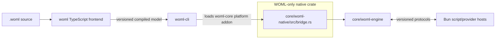

# WOML Legacy Cronflow Core Audit and Removal Map

Status: Audit 0 through Audit 6 completed on 2026-08-15. The dependency and
removal map is frozen, the canonical WOML N-API adapter lives in a dedicated
native crate that depends only on `woml-engine`, and every CLI build/release path
now stages that crate directly. CI permanently verifies source imports, native
dependencies, adapter imports, addon exports, and clean-package dependencies.
The temporary combined-core WOML shim, complete JavaScript-chaining package
surface, and closed legacy Rust graph have been removed. `core/Cargo.toml` is
now a two-member WOML-only workspace with one committed lockfile. The repository
root is private and cannot publish the former `cronflow` package accidentally.
No user database or project data was removed.

## 1. Executive Conclusion

The WOML runtime does **not** execute workflows through the legacy Cronflow
bridge, dispatcher, trigger executor, step orchestrator, state machine, mutable
context, or database model.

There is no remaining execution or packaging coupling:

- [`core/woml-engine`](core/woml-engine) is an independent Rust crate and is
  the WOML execution, persistence, recovery, trigger, policy, service, and
  inspection authority.
- [`core/woml-native`](core/woml-native) is the extracted native crate. Its
  canonical adapter at
  [`core/woml-native/src/bridge.rs`](core/woml-native/src/bridge.rs) imports
  `woml_engine`; it does not import the legacy Rust modules.
- The former combined `core` package, its N-API bridge, mutable execution graph,
  database schema, build shell, dependencies, and tests are absent.
- [`core/Cargo.toml`](core/Cargo.toml) is a virtual workspace containing only
  `woml-engine` and `woml-native`.
- [`woml-cli/scripts/stage-native.ts`](woml-cli/scripts/stage-native.ts) builds
  and stages `woml-native` as the stable
  `woml-core.<platform>-<arch>.node` artifact.
- The WOML frontend and CLI do not import the JavaScript-chaining SDK.
- `.github/workflows/ci.yml` runs the architecture-separation gate on every
  push and pull request, so these boundaries cannot silently regress.

The operational, authoring, and Rust dependency cleanup is complete.

## 2. Audit Scope and Method

This audit covers the paths named in the roadmap:

- JavaScript-chaining SDK and public package entry points;
- legacy Rust N-API bridge;
- dispatcher and job queue;
- trigger manager, trigger executor, and webhook server;
- step orchestrator and workflow state machine;
- mutable context, models, state, and database;
- native-addon build and platform packaging;
- the WOML frontend, CLI, N-API adapter, and engine consumers; and
- legacy tests, generated types, scripts, and persisted-data boundaries.

The conclusions are dependency-backed. They come from static imports, Cargo
manifests, package entry points, native symbol consumers, database schemas, and
test/build commands. Generated build output and `node_modules` were excluded
as sources of architectural truth.

Audit 0 deliberately did not:

- delete or move source files;
- change public exports;
- rename schemas or frozen contract identifiers;
- migrate or delete databases;
- change `woml run`; or
- assume that old users no longer require the `cronflow` package.

## 3. Current Architecture and Dependency Boundary



Only the WOML build product and runtime graph remain.

### 3.1 The current WOML path

```text
.woml source
  -> woml/src/parser.ts
  -> woml/src/compiler.ts
  -> versioned compiled DAG and definition package
  -> woml-cli/src/cli.ts
  -> woml-cli/src/rust-executor.ts
  -> executeWoml*/startWoml*/submitWoml* N-API functions
  -> core/woml-native/src/bridge.rs canonical adapter
  -> core/woml-engine
  -> durable WOML event log and folded projections
  -> isolated Bun execution hosts when JavaScript is required
```

The frontend owns WOML markup. Rust receives the compiled model. The Bun hosts
execute JavaScript but do not decide graph progression, retries, durable
admission, or recovery.

### 3.2 The retired Cronflow path

```text
src/index.ts
  -> sdk/index.ts
  -> sdk/src/cronflow.ts and WorkflowInstance chaining
  -> sdk/src/utils/core-resolver.ts
  -> registerWorkflow/createRun/executeStep/... N-API functions
  -> core/src/bridge.rs
  -> legacy triggers/dispatcher/orchestrator/state machine/state/database
```

Every file in this historical path was removed in Audit 5 or Audit 6. It remains
shown only to explain the deletion boundary; it is not a buildable path.

## 4. Rust Core Inventory

The classification terms used below are:

- **Keep**: authoritative WOML code.
- **Legacy-only**: not used by the WOML runtime; removable after retirement
  gates are satisfied.
- **Reshape**: contains both build concerns today and must be split before
  deletion.

| Path | Current responsibility | WOML relationship | Classification |
| --- | --- | --- | --- |
| [`core/woml-engine`](core/woml-engine) | Compiled DAG execution, immutable events, folding, SQLite durability, recovery, triggers, approvals, retries, workflow calls, lifecycle, policies, state, services, operations, backup, retention, and presentation | Direct execution authority | **Keep** |
| [`core/woml-native`](core/woml-native) | WOML-only `cdylib`/N-API build owner | Directly depends on adapter libraries and `woml-engine`; no legacy dependency | **Keep; Audit 1 complete** |
| [`core/woml-native/src/bridge.rs`](core/woml-native/src/bridge.rs) | Converts N-API arguments/progress callbacks into `woml-engine` calls and serializes outcomes | Canonical extracted CLI boundary; imports `woml_engine`, not legacy modules | **Keep in WOML native crate** |
| Former `core/src/woml_bridge.rs` | Included the canonical adapter into the combined addon during the transition | Removed after the CLI packaging switch | **Removed in Audit 2** |
| Former `core/src/lib.rs` | Declared the combined legacy crate | No WOML relationship | **Removed in Audit 6** |
| Former `core/src/bridge.rs` | Legacy N-API facade | Replaced by the WOML-only adapter | **Removed in Audit 6** |
| Former models, context, database, schema, and state modules | Mutable chained-workflow authority | Replaced by compiled models, immutable events, and folding | **Removed in Audit 6** |
| Former jobs, dispatcher, condition evaluator, state machine, and orchestrator | Legacy execution loop | Replaced by the WOML DAG runtime and policy scheduler | **Removed in Audit 6** |
| Former triggers, trigger executor, and webhook server | Legacy ingress | Replaced by WOML trigger authority | **Removed in Audit 6** |
| Former config and error modules | `CRONFLOW_*` configuration and shared legacy errors | WOML owns its configuration and diagnostics | **Removed in Audit 6** |

### 4.1 Legacy Rust dependency closure

The old bridge is the root of a closed legacy graph:

```text
bridge
  -> triggers -> error
  -> webhook_server -> state -> database -> models
  -> trigger_executor
       -> dispatcher -> job
       -> step_orchestrator -> workflow_state_machine
            -> condition_evaluator -> context
  -> config/error/models throughout
```

The canonical WOML adapter is outside this closure. Audit 1 moved it to a
native crate with a direct dependency on `woml-engine`, and Audit 2 stopped
staging the combined artifact. The complete graph above is no longer a WOML
build or runtime dependency.

## 5. TypeScript, Package, and Test Inventory

| Path | Current responsibility | Classification |
| --- | --- | --- |
| [`woml`](woml) | WOML parsing, source diagnostics, validation, references, modules, reusable definitions, and compiled-model lowering | **Keep** |
| [`woml-cli`](woml-cli) | `woml` command, activation, secret resolution, native adapter, Bun hosts/providers, trigger transports, operations, and terminal experience | **Keep** |
| Former `sdk/` | Public JavaScript chaining API and overlapping JS runtime subsystems | **Removed in Audit 5** |
| Former `sdk/src/utils/core-resolver.ts` | Resolved old `@cronflow/*` native packages and development `core.node` locations | **Removed in Audit 5** |
| Former `sdk/src/rust/integration.ts` | Converted a chained workflow into the old Rust model | **Removed in Audit 5** |
| Former `sdk/src/execution/workflow-engine.ts` | Owned JavaScript workflow sequencing and handler execution | **Removed in Audit 5** |
| Former `sdk/src/cronflow.ts` | Owned the singleton registry and public `define/start/stop/trigger` behavior | **Removed in Audit 5** |
| Former `sdk/src/webhook/server.ts` | Hosted the legacy JavaScript webhook path | **Removed in Audit 5** |
| Former `src/index.ts` | Exposed the root `cronflow` compatibility API | **Removed in Audit 5** |
| [`package.json`](package.json) | Private WOML repository command facade | **Replaced in Audit 5; no exports or publish configuration** |
| Former `core/package.json` | Published `@cronflow/core` and named the combined binary | **Removed in Audit 6** |
| Former root `tests/` | SDK, native bridge, dispatcher, and mutable-state fixtures | **Removed across Audit 5 and Audit 6** |
| Former root `scripts/` | Generated and packaged the chained SDK | **Removed in Audit 5** |

The WOML CLI does not use the old `@cronflow/*` resolver. It expects
`woml-core.<platform>-<arch>.node` beside its built CLI and supports the
WOML-specific `WOML_RUST_CORE_PATH` development override.

## 6. Persistence Is Not Shared

Legacy Cronflow and WOML do not merely use different table names; they use
different state models.

### 6.1 Legacy data model

The former `core/src/schema.sql` stored authoritative mutable rows:

- `workflows`;
- `workflow_runs`;
- `step_results`;
- `triggers`;
- `v_active_runs`; and
- `v_step_summary`.

The chaining SDK defaults to legacy paths such as `.cronflow/data.db`.

### 6.2 WOML data model

[`core/woml-engine/src/durable.rs`](core/woml-engine/src/durable.rs) owns the
versioned WOML store. It includes immutable definitions and run events plus
coordination/projection tables for approvals, trigger occurrences, schedules,
intervals, internal events, module artifacts, workflow calls, runtime routes,
policies, ownership, durable state, backup, and retention. `woml-cli` defaults
to `.woml/state.sqlite`.

### 6.3 Retirement rule for user data

Deleting legacy source must never delete `.cronflow`, `cronflow.db`, a custom
legacy database path, or an old platform package from a user's project.

There is no truthful automatic conversion from an arbitrary in-flight legacy
run to a WOML event history. The retirement journey should instead provide:

1. a final legacy version capable of reading/exporting its own records;
2. a migration guide for rewriting workflow definitions as `.woml`;
3. explicit guidance to settle or cancel legacy active runs before upgrade;
4. an archive/export option for historical legacy runs; and
5. a statement that WOML starts new runs from newly compiled definitions rather
   than fabricating events for old executions.

## 7. Frozen Identifiers Are Not Legacy Runtime Dependencies

Many published JSON Schemas use `https://cronflow.dev/schemas/...` as their
`$id`. Those strings are already embedded in versioned compiled models,
fixtures, validators, and historical data.

They must **not** be mass-renamed during code removal. A schema identifier is
an identity, not a marketing link. Renaming it would either break validation
and recovery or require a reviewed compatibility migration across every model
and event version.

Likewise, repository URLs, package names, comments, documentation headings,
and the generic Rust crate name `core` are branding/packaging cleanup items.
They are not evidence that WOML executes the old engine. Handle them after the
runtime split, with frozen schema identities considered separately.

## 8. Final WOML Replacement Boundary

The required runtime replacement is active: `core/woml-native` is the WOML-only
native addon shell and the CLI's build and packaged-artifact authority.

The resulting boundary is:

```text
woml-cli
  -> woml-core.<platform>-<arch>.node       stable packaged filename
  -> dedicated WOML N-API crate            new build owner
  -> woml-engine                           unchanged Rust authority
```

The dedicated native crate now owns:

- the canonical code in `core/woml-native/src/bridge.rs`;
- N-API, callback, Tokio, JSON, time, and adapter-only dependencies;
- the native library name and build script; and
- a checked list of all required JavaScript-facing WOML exports.

Audit 2 moved platform artifact staging and packaged-release verification from
the combined `core` build to this crate.

Its manifest has no local dependency except `woml-engine`, and its boundary
test rejects imports from the legacy graph. The JavaScript-facing filename can
remain `woml-core.<platform>-<arch>.node`, so the normal user command and CLI
lookup contract did not change.

## 9. Removal Sets

### 9.1 Keep permanently as current WOML architecture

- `woml/`;
- `woml-cli/`;
- `core/woml-engine/`;
- `docs/schemas/` and `docs/protocols/`;
- WOML fixtures, examples, release tests, and editor support; and
- the N-API surface implemented by `core/woml-native/src/bridge.rs`.

### 9.2 Removed in Audit 5

- `sdk/` and `src/index.ts`;
- root chaining-SDK tests;
- legacy type generation, bundle analysis, installation, and npm packaging
  scripts;
- root JavaScript build/type/test configuration and legacy lockfiles;
- the public `cronflow` exports, optional `@cronflow/*` packages, SDK runtime
  dependencies, and publish metadata; and
- the draft retirement-window contract, which was explicitly waived before
  external publication because the unused library is being retired now.

The migration guide and manual legacy-data archive procedure remain. Historical
examples and broad documentation cleanup remain assigned to Audit 7.

### 9.3 Removed in Audit 6

- all legacy modules listed in Section 4;
- `core/src/schema.sql`;
- the legacy contents of `core/src/lib.rs` and its unit tests;
- legacy dispatcher/N-API tests and committed legacy native fixtures; and
- legacy native dependencies no longer required by the WOML-only adapter.

The root Cargo manifest is now a virtual workspace containing only
`woml-engine` and `woml-native`. Its committed `core/Cargo.lock` is generated
from those two manifests, so deleted legacy dependencies cannot remain direct
workspace dependencies.

### 9.4 Review individually, do not bulk-delete

- root `README.md`, `LICENSE`, and release metadata;
- repository URLs and GitHub workflows;
- shared formatting/lint configuration;
- examples that may be useful as migration documentation;
- root scripts containing both generic packaging logic and Cronflow names;
- `docs/architecture.md`, whose legacy section remains useful migration
  context until retirement; and
- `cronflow.dev` schema identifiers, which should normally remain frozen.

## 10. Ordered Removal Map

This is a dependency order, not a request to execute all steps immediately.

### Audit 0 — Complete: freeze the map

Result: this document identifies the execution boundary, legacy closure,
required replacement, data rule, risks, and proof gates. No deletion occurs.

### Audit 1 — Complete: extract the WOML native adapter

The canonical adapter now lives in `core/woml-native`, whose manifest depends
locally only on `woml-engine`. The combined core includes that same source
through a small compatibility shim, avoiding a duplicated implementation before
the Audit 2 switch. That temporary shim has now been removed.

Result: the standalone crate builds without the legacy core in its Cargo tree.
Its 36 JavaScript-facing WOML exports exactly matched the WOML subset exposed by
the combined addon. The old combined addon remained usable until Audit 2 moved
the CLI to the dedicated artifact.

Audit 1 evidence:

- `core/woml-native/tests/separation.rs` enforces the local dependency and
  source-import boundary;
- `woml-cli/scripts/verify-native-exports.ts` freezes and verifies the binary
  export surface;
- both `woml-native` and the combined `core` pass single-job offline builds;
- `examples/terminalExperience/sequential.woml` executes through the extracted
  addon and returns `{"message":"Hello Dali"}`; and
- the WOML CLI TypeScript project still type-checks.

### Audit 2 — Complete: switch the CLI build and release path

The CLI now builds the locked `core/woml-native/Cargo.toml` manifest directly.
Staging maps `libwoml_core.so`, `libwoml_core.dylib`, or `woml_core.dll` to the
unchanged public `woml-core.<platform>-<arch>.node` name. The temporary combined
core shim and module declaration are gone.

Audit 2 evidence:

- `bun run build:native` compiles only `woml-native` and its `woml-engine`
  dependency, then stages the dedicated release artifact;
- `core/woml-native/tests/separation.rs` proves the legacy crate no longer
  compiles or exports the WOML adapter;
- `woml-cli/tests/native-release-boundary.test.ts` freezes Linux, macOS, and
  Windows x64/arm64 artifact names and executes a real workflow through
  `WOML_RUST_CORE_PATH`;
- `woml-cli/scripts/verify-native-exports.ts` checks the staged package artifact
  and its exact 36-function WOML surface;
- the clean package installation terminal journey executes through the staged
  addon; and
- `test:native-release-boundary` is part of the repository `test:release`
  journey.

Result: `woml run` is operationally independent of the legacy crate, not merely
source-independent.

### Audit 3 — Complete: add separation gates

The `test:architecture-separation` command now builds the dedicated addon and
fails if:

- the WOML native crate acquires any local dependency except `woml-engine`;
- source in `woml` or `woml-cli` imports `sdk`, `cronflow`, or an
  `@cronflow/*` package;
- the canonical native adapter imports a legacy Rust module;
- the built addon differs from the 36-function required native surface;
- the CLI `NativeCore` interface omits one of those functions; or
- a clean packed WOML installation declares or installs an `@cronflow/*`
  runtime package.

Audit 3 evidence:

- `woml-cli/scripts/verify-architecture-separation.ts` scans the source,
  adapter, CLI contract, built binary, and isolated packed installation;
- `woml-cli/tests/architecture-separation.test.ts` verifies static, dynamic,
  CommonJS, and runtime-package detection without confusing metadata or
  development-only dependencies;
- `core/woml-native/tests/separation.rs` remains the Rust-owned dependency and
  adapter-import gate;
- `woml-cli/scripts/verify-native-exports.ts` provides the one canonical export
  list shared by binary and CLI-contract verification;
- `.github/workflows/ci.yml` runs the complete gate on every push and pull
  request; and
- the repository `test:release` journey also starts with this gate.

Result: future changes cannot silently reconnect the architectures.

### Audit 4 — Superseded before publication

A formal six-month SDK retirement-window draft was prepared, but the product
owner explicitly waived it before external publication because the small
library has no meaningful adoption and immediate removal is preferred. The
draft contract and its CI gate were deleted. Its useful migration and
data-archive guidance was retained independently.

Result: there is no fictional support promise blocking the actual product
direction.

### Audit 5 — Complete: retire the JavaScript-chaining package surface

Audit 5 removed the entire `sdk/` tree, the root compatibility entry,
generated-type and packaging scripts, SDK tests, JavaScript build configuration,
legacy root lockfiles, runtime dependencies, optional `@cronflow/*` packages,
the legacy tag-release workflow, and npm publication metadata. The root manifest is now a private WOML
repository facade with commands delegated to `woml-cli`.

CI no longer installs or tests the retired SDK. It tests the WOML frontend and
the permanent architecture-separation boundary instead. The root README now
documents only WOML, while the migration guide and safe manual archive
procedure remain available to anyone with an old local project.

The architecture-separation gate now also rejects a publishable root manifest,
the `cronflow` package name, root JavaScript entry/type/export metadata,
Cronflow runtime dependencies, a restored SDK entry point, or the former
legacy tag-release workflow.

The legacy Rust crate and its dispatcher/N-API tests remain for Audit 6. The
ignored `cronflow.db` and any `.cronflow` user state were deliberately untouched.

Result: there is one public workflow authoring surface: WOML.

### Audit 6 — Complete: remove the legacy Rust closure

Audit 6 removed the old bridge, models, context, database/schema, state, jobs,
dispatcher, condition evaluator, state machine, step orchestrator, triggers,
trigger executor, webhook server, config, errors, combined build script,
`@cronflow/core` package shell, root legacy tests, committed test database, and
legacy native fixtures.

`core/Cargo.toml` is now a virtual workspace with exactly two members:
`woml-engine` and `woml-native`. The workspace owns the release profile and one
committed lockfile. Cargo metadata contains no package named `core`, and the
CLI's manual-trigger gate no longer asks Cargo to compile `-p core`.

The Rust and TypeScript separation gates now reject a restored combined crate,
legacy source/schema/build/package files, any extra local native dependency, or
a workspace member other than the engine and adapter.

Audit 6 evidence:

- locked Cargo metadata reports exactly `woml-engine` and `woml-native` as
  workspace members;
- the complete workspace passes `cargo check --workspace --all-targets` with
  one build job;
- all 16 engine library tests and all native separation tests pass against the
  consolidated workspace lockfile;
- the optimized native addon rebuilds and retains exactly 36 WOML-only exports;
- clean-package architecture verification finds no legacy SDK, Rust package,
  or `@cronflow/*` runtime dependency; and
- `woml test hello.woml` executes successfully through the rebuilt addon.

The ignored root `cronflow.db`, `.cronflow/`, and `.woml/` state were not read,
migrated, or deleted. Git retains the removed source and committed fixtures in
repository history.

Result: the shipped Rust execution stack contains only WOML authority and its
native adapter.

### Audit 7 — Clean packaging and documentation residue

Remove retired `@cronflow/*` packages and install scripts, update package and
repository metadata, archive legacy documentation, and decide branding changes
separately from immutable schema identities.

Result: source layout, packages, docs, and product naming describe the same
WOML architecture.

## 11. Required Proof Before Deletion

Removal is approved only when all applicable gates pass from a clean checkout:

1. `woml-engine` builds and tests independently.
2. The dedicated native addon builds without the legacy crate in its Cargo
   dependency graph.
3. Its exported WOML N-API surface matches the CLI's `NativeCore` contract.
4. The WOML frontend suite validates every published model and definition
   package.
5. The CLI's native, script-host, notification, trigger, approval, retry,
   parallel, fork, switch, reusable-definition, workflow-call, lifecycle,
   policy, state, production, and terminal release suites pass.
6. A packed `woml-cli` runs representative small and complex workflows without
   a repository checkout or `@cronflow/*` dependency.
7. Restart recovery succeeds against the supported historical WOML store,
   model, event, and definition-package versions.
8. Webhook, schedule, interval, event, Slack, and real manual triggers activate
   through the WOML ingress authority.
9. Backup, restore, retention, inspection, log following, cancellation, and
   background runtime operation remain intact.
10. Static dependency checks find no SDK or legacy-core import from WOML code.
11. The migration guide and legacy data archive procedure have been reviewed.
12. The removal change does not delete user databases or project files.

## 12. Principal Risks and Controls

| Risk | Control |
| --- | --- |
| Deleting a legacy module that is still pulled into the native addon | Extract and prove the WOML-only addon before deletion |
| Accidentally changing the CLI's native protocol while moving the adapter | Preserve N-API names and add export/fixture conformance tests |
| A clean package works locally only because `core.node` exists in the repository | Test the packed CLI in an empty temporary project |
| Historical WOML runs fail after the split | Run supported store/model/event recovery suites against the new addon |
| Old Cronflow users lose active or historical data | Preserve archive/export guidance and never delete data automatically |
| Frozen `cronflow.dev` schema IDs are mistaken for dead branding | Treat schema IDs as immutable protocol identities |
| Duplicate TypeScript and Rust execution paths remain after SDK removal | Remove the entire chaining SDK executor closure, not only its public `define()` facade |
| Dependencies remain bloated after source deletion | Prune Cargo/npm dependencies only after the isolated build passes |

## 13. Final Audit Decision

The legacy Cronflow Rust core has been removed through the dependency-backed
Audit 6 boundary.
WOML has already replaced its behavior with a separate frontend, compiled DAG,
durable event-sourced Rust engine, Bun execution hosts, trigger authority, and
operations runtime. The WOML and legacy N-API surfaces no longer share a native
crate or release path.

The approved technical direction is:

1. ~~extract the WOML native adapter~~ — completed in Audit 1;
2. ~~switch and prove the CLI package against the extracted crate~~ — completed
   in Audit 2;
3. ~~resolve SDK retirement policy~~ — the unused-library support-window draft
   was explicitly waived before publication;
4. ~~remove the JavaScript chaining surface~~ — completed in Audit 5;
5. ~~remove the closed legacy Rust graph~~ — completed in Audit 6; and
6. clean packaging and branding without rewriting frozen protocol history.

Only Audit 7 packaging and documentation residue remains; frozen WOML protocol
identities are not legacy code and remain unchanged.
