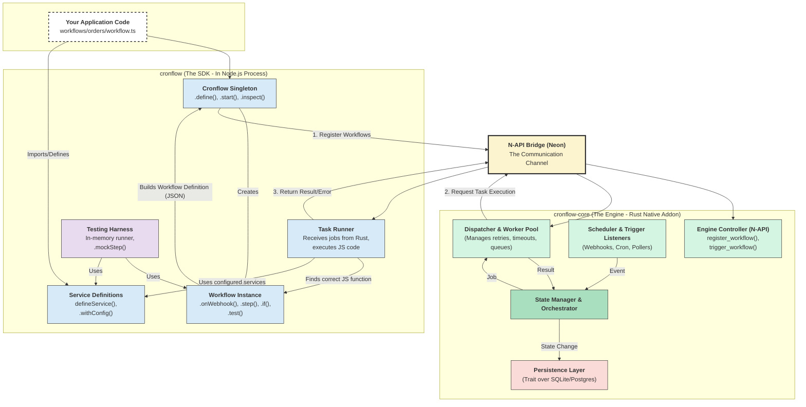

# WOML and Legacy Cronflow Architecture

## Current WOML Architecture (Authoritative)

WOML is the current product direction. Authors describe workflows in readable
`.woml` markup, while execution remains split across three deliberately narrow
layers:

```text
.woml source
    -> TypeScript frontend: parse, validate, lower to a versioned DAG
    -> Bun CLI / N-API boundary
    -> Rust core: orchestrate, persist events, schedule and recover
    -> long-lived Bun Script Host
    -> isolated Worker: execute one JavaScript attempt
    -> Rust event log and folded context
    -> CLI result
```

The TypeScript frontend is the only layer that understands WOML markup,
attributes, raw `<script>` bodies, and `{{context...}}` references. Its output is
a versioned, language-neutral compiled workflow model whose nodes and edges form
a DAG. It does not execute the workflow.

The Rust core is the execution authority. It validates the compiled model,
selects ready DAG nodes, owns branch/parallel/approval/retry decisions, appends
versioned events to SQLite, and rebuilds run context by folding those events. It
must not understand markup, interpolation syntax, or JavaScript source meaning.

The long-lived Bun host executes JavaScript because JavaScript is part of the
authoring experience. Each invocation runs in an isolated Worker with a real
timeout boundary and receives only the versioned bindings approved for its
model. Model v8 and Script Bindings v1 inject exactly `context`, `attempt`,
`services`, and source-proven `secrets` into capability scripts. Native Fetch,
managed HTTP, and the SQLite/PostgreSQL Database v1 facade are active through SC8. Bun reports
outcomes; it never decides whether to retry or how the graph advances.

### Services and capability boundary

SC0 freezes a generic, full-duplex capability boundary before adding provider
code. Script Host v4 permits multiple invocations and multiple nested calls to
be active; replies correlate by `{invocationId, callId}` and may arrive out of
order. Rust owns the capability registry, operation limits, cancellation,
idempotency identity, durable Run Event v8 append, and recovery. Bun owns the
JavaScript facades and isolated execution.

Native Fetch stays Bun's real Fetch implementation and uses redacted observed
events. `services.http.request()`, `services.db()`, and future `services.*`
operations use Rust-managed calls. All converge on the generic `operation_started`,
`operation_succeeded`, and `operation_failed` vocabulary. Compiled models keep
only sorted secret names; resolved values exist only in the invocation-memory
boundary and never in context, events, progress, or fixtures. Native Fetch is
executed by Bun; `services.http.request()` is executed by a pooled Rust client;
and Database v1 uses Rust-owned SQLite and PostgreSQL pools. SQLite user
connections cannot open WOML's internal state database; PostgreSQL connection
strings and credentials never become safe event metadata. Other `services.*` capabilities remain
unavailable until their individual milestones. The authoritative Database v1
guide is `docs/woml-database.md`.

The local outbound-HTTP profile permits reachable HTTP(S) destinations and is
not an SSRF sandbox. Hosted deployments must apply network-layer egress policy,
including private/link-local denial, DNS-resolution checks, and redirect
revalidation. The authoritative operational guidance is
`docs/woml-http-services.md`.

### Durable retry boundary

Rust commits a failed attempt and its next retry schedule atomically. All
attempts of one logical step share `attempt.idempotencyKey`, allowing a capable
external service to deduplicate effects. A durably scheduled but unstarted
retry is safe to resume. A started attempt without a terminal event is
ambiguous, becomes `interrupted`, and fails closed instead of being replayed.
Only a successful attempt publishes `context.steps.<id>`.

### Production trigger admission boundary

The TypeScript frontend describes triggers in compiled Model v7, but it does
not accept external occurrences or create runs. Every listener, scheduler, and
provider adapter must submit a normalized occurrence to the Rust authority.
Rust validates the compiled trigger and atomically commits three related facts:
the immutable occurrence, its run-to-definition binding, and the run's first
`run_started` Event v7.

SQLite store schema v6 preserves the v4 one-run-per-occurrence guarantees,
adds durable schedule cursors in v5, and adds anchored interval cursors in v6.
Occurrences remain unique by the
workflow, trigger, and hashed source identity. The raw source identity is never
persisted. Payload hashes use RFC 8785 canonical JSON, so reordered object keys
do not create a second run. A same-payload replay returns the original run; a
changed-payload replay conflicts. If the process stops after commit but before
dispatch, recovery resumes that existing run rather than creating another one.
Contradictory occurrence, run, definition, or event history fails closed.

For cron schedules, the mutable cursor is the scheduler's durable coordination
record. Rust commits its advance in the same immediate transaction as the
immutable occurrence, run binding, and first event. Schedule-only and provider-
only runtimes do not bind an HTTP socket; webhook and named-event workflows
bind the configured listener.

For fixed-rate intervals, Rust persists the first registration anchor and the
next positive sequence. Every planned instant is recomputed as `anchor +
sequence × every`, so slow workflow runs cannot introduce timing drift. The
interval cursor advances in the same transaction as occurrence admission.
Restart recovery applies the same bounded `skip` or `run-once` policy as cron,
and only `{ scheduledAt, triggeredAt }` enters workflow context.

Named application events add a fan-out boundary above Trigger Ingress rather
than a second run creator. The frontend lowers each exact event name, symbolic
publisher-secret reference, and optional schema into Model v7. Event
Publication v1 deterministically matches
subscribers and sends one independently validated occurrence per matching
trigger through the existing Rust authority. Its source identity hashes the
publisher event ID together with workflow and trigger identity, allowing a
crash or publisher retry to finish missing deliveries without duplicating
already accepted runs. The Rust host serves the reserved authenticated HTTP
endpoint, and `woml emit` is a secret-store-backed client for the same public
contract. Resolved credential values remain outside compiled models, durable
workflow context, fixtures, and diagnostics.

The webhook listener is part of this WOML Rust path, not the legacy Cronflow
webhook module. It validates transport, authentication, body size and JSON
Schema before admission, returns the durable run identity asynchronously, and
dispatches only newly admitted runs. A duplicate returns the original run
without executing it again. Server startup performs crash recovery once;
individual requests never run global recovery while other attempts may be
active. The T5 production gate covers concurrent requests, slow and malformed
clients, SQLite contention, listener and route conflicts, bounded bodies,
secret leakage, host failure, and composition with every already-published
control-flow primitive. Bearer routes retain only a fixed-width credential
digest after registration and compare candidate digests in constant time.

Slack uses a shared Bun transport foundation for symbolic credential
resolution, Web API calls, channel lookup/cache, Socket Mode connection and
reconnect, and secret-safe error classification. The approval adapter and the
Slack-trigger adapter remain separate protocol consumers. Matching app-token
credentials share one Socket connection, while each consumer owns its own
message semantics. The shared layer never acknowledges ordinary event
envelopes automatically: approval interactions acknowledge in the approval
adapter, while trigger events acknowledge only after durable Rust admission.
Slack event decoding, normalization, filtering, redelivery deduplication, and
execution are active in the T13 Production Triggers profile.

`woml run` is the long-lived activation lifecycle. The Bun CLI preflights the
definitions and symbolic secrets, then starts the Rust listener through N-API
and waits for SIGINT or SIGTERM. Rust runs Actix on a dedicated runtime thread,
owns every occurrence and background DAG execution, and emits versioned Trigger
Progress v1. Completing one run does not stop the activated workflow. `woml
test` is the separate one-shot manual journey, and `woml runs get` reads a safe
folded durable result.

Progress and diagnostics are printed to stderr. A successful asynchronous run
is then folded from durable state and its final JSON is printed with its run ID;
`woml runs get` provides the same result later. One-shot manual results remain
JSON on stdout. Secrets and executable capabilities never enter context,
events, progress messages, or durable output.

The contracts between these layers are versioned artifacts under
`docs/schemas/` and `docs/protocols/`. Neither side may infer or silently add a
field that is absent from the negotiated version.

## Legacy Cronflow Architecture (Migration Context)

The remainder of this document describes the original JavaScript-chaining SDK.
It remains useful as migration context, but it is not the architecture used by
`woml run`. The SDK will be retired only after WOML reaches sufficient feature
parity and users have a documented migration path.

## Overview

cronflow is a sophisticated workflow automation engine built on a **hybrid architecture** that combines the developer-friendly experience of Node.js with the rock-solid reliability and performance of Rust. This document provides the complete architectural reference for the entire system.

## Core Philosophy

The architecture follows a clear separation of concerns:

- **Node.js (The SDK)**: Handles the **Developer Experience (DX)**. It's the friendly, flexible, and dynamic "frontend" for the developer.
- **Rust (The Core Engine)**: Handles **Reliability and Performance**. It's the powerful, durable, and stateful "backend" that does the heavy lifting.

## High-Level Architecture

### Architectural Diagram



## Division of Responsibilities

The architecture leverages each language's strengths through a clear division of responsibilities:

| Responsibility / Domain            | Node.js (The SDK)                                                                                                                                                                                                                      | Rust (The Core Engine)                                                                                                                                                                                                                                 |
| ---------------------------------- | -------------------------------------------------------------------------------------------------------------------------------------------------------------------------------------------------------------------------------------- | ------------------------------------------------------------------------------------------------------------------------------------------------------------------------------------------------------------------------------------------------------ |
| **Workflow Definition**            | **PRIMARY**. Provides the entire fluent API: `cronflow.define()`, `.step()`, `.if()`, `.retry()`, etc. Its job is to build a declarative JSON representation (WDO) of the workflow.                                                    | **SECONDARY**. Receives the final JSON WDO. Its only job is to parse this JSON into its internal Rust structs for storage and execution. It has no knowledge of how the JSON was built.                                                                |
| **State Management & Persistence** | **STATELESS**. It holds no state between steps. It receives a `ctx` object for each job, uses it, and then forgets it.                                                                                                                 | **PRIMARY**. The "brain" of the system. Manages the state of every workflow and step (`RUNNING`, `FAILED`, etc.). It owns the database connection and is responsible for all CRUD operations on the internal SQLite/Postgres database.                 |
| **Scheduling & Triggers**          | **DEFINITION**. Defines what the trigger is (`.onSchedule(...)`, `.onWebhook(...)`). This information is serialized into the WDO.                                                                                                      | **IMPLEMENTATION**. Runs the actual cron scheduler. Runs the actual web server to listen for webhooks. Manages the stateful logic for polling. It is the active "listener" for all events.                                                             |
| **Task Execution**                 | **PRIMARY**. This is where the user's business logic runs. The "Task Runner" module receives a job from Rust, finds the correct JavaScript function `(ctx) => ...`, and executes it (e.g., fetch calls, db queries).                   | **SECONDARY**. Acts as a "Dispatcher." It tells the Node.js Task Runner which step to execute and then waits for a result. It treats the Node.js side as a "function execution service."                                                               |
| **Integrations & Services**        | **PRIMARY**. `defineService` and `.withConfig` are pure Node.js concepts. All the logic for talking to external APIs (Stripe, Slack, etc.) is written in TypeScript and lives here.                                                    | **SECONDARY**. Knows nothing about specific services like Slack or JIRA. It only provides the generic, low-level primitives that integrations can use (e.g., `engine.storage`, `engine.createWebhookTrigger`).                                         |
| **Error Handling & Retry Logic**   | **PRODUCES ERRORS**. When a user's step throws an exception, the Node.js Task Runner catches it and passes the serialized error back to Rust.                                                                                          | **MANAGES RETRIES**. Receives the error from Node.js. It then reads the step's retry configuration, manages the backoff delay, updates the attempt count in the database, and decides whether to re-dispatch the job or mark it as permanently failed. |
| **Concurrency & Performance**      | **SECONDARY**. The Node.js event loop handles I/O concurrency for the tasks it is told to run.                                                                                                                                         | **PRIMARY**. The tokio multi-threaded runtime manages the engine's worker pool for high-throughput job dispatching. It's responsible for connection pooling (DB, HTTP) and keeping overall CPU/memory usage low.                                       |
| **Testing**                        | **PRIMARY**. Provides the entire `.test()` harness (`.mockStep`, `.expectAction`, etc.). It includes an in-memory workflow runner that simulates the Rust engine's behavior to enable fast, easy testing without any Rust interaction. | **NOT INVOLVED** in the user-facing testing API. The Rust core's correctness is verified by its own separate suite of Rust unit and integration tests (`cargo test`).                                                                                  |
| **Configuration & Lifecycle**      | **PRIMARY**. Provides the user-facing API to start and stop the system (`cronflow.start()`, `cronflow.stop()`). It's also where the user provides `.env` or other configuration.                                                       | **IMPLEMENTATION**. Implements the actual lifecycle. It receives the start command and boots up all its internal components (scheduler, web server, DB pool). On stop, it gracefully shuts them down.                                                  |
| **Logging**                        | **SECONDARY**. The user's code can `console.log` within a step. The SDK can also provide a structured logger on the `ctx` object.                                                                                                      | **PRIMARY**. The engine performs its own structured logging for all core events (e.g., "Run Started", "Dispatching Job", "State Updated", "Engine Shutdown"). This provides a complete audit trail of the engine's internal operations.                |

## Component Breakdown

### 1. Node.js SDK Layer

The public-facing package that provides the developer experience.

#### **Cronflow Singleton**

- **Entry Point**: `import { cronflow } from 'cronflow'`
- **Responsibilities**:
  - Maintains registry of all defined Workflow instances
  - Provides `.define()`, `.start()`, `.trigger()`, `.inspect()` methods
  - Serializes workflow definitions to JSON for Rust engine
  - Manages engine state (`STOPPED`, `STARTING`, `STARTED`)

#### **Workflow Instance**

- **Creation**: Object created by `cronflow.define()`
- **Responsibilities**:
  - Builder pattern for workflow definition
  - Builds **Workflow Definition Object (WDO)** in memory
  - Provides fluent API: `.onWebhook()`, `.step()`, `.if()`, `.parallel()`
  - Serializable JSON representation of entire workflow

#### **Task Runner**

- **Role**: Internal callback target for Rust engine
- **Responsibilities**:
  - Receives job requests via N-API bridge
  - Re-hydrates context object (`ctx.payload`, `ctx.steps`)
  - Executes user-defined JavaScript functions
  - Returns results or errors to Rust engine

#### **Testing Harness**

- **Purpose**: In-memory workflow execution for testing
- **Responsibilities**:
  - Bypasses Rust engine for fast testing
  - Provides `.mockStep()`, `.expectAction()` methods
  - Enables unit and integration testing without external dependencies

### 2. Rust Engine Layer

The high-performance core that handles orchestration and reliability.

#### **Engine Controller (N-API)**

- **Role**: Public-facing Rust module exposed to Node.js
- **Responsibilities**:
  - Provides N-API interface for Node.js communication
  - Handles workflow registration and triggering
  - Manages serialization/deserialization of data

#### **State Manager & Orchestrator**

- **Role**: The "brain" of the system
- **Responsibilities**:
  - Maintains state of every workflow run (`PENDING`, `RUNNING`, `SUCCESS`, `FAILED`)
  - Reads workflow JSON graphs from database
  - Determines next steps based on current state and graph
  - Understands control flow logic (`.if`, `.parallel`, `.batch`)
  - Creates jobs and sends them to Dispatcher

#### **Scheduler & Trigger Listeners**

- **Responsibilities**:
  - Manages time-based events (`onSchedule`, `onInterval`)
  - Runs high-performance web server for webhooks (`onWebhook`)
  - Handles polling triggers with stateful logic
  - Manages event buffering for complex triggers
  - Notifies State Manager when trigger conditions are met

#### **Dispatcher & Worker Pool**

- **Role**: The "hands" of the engine
- **Responsibilities**:
  - Receives jobs from State Manager
  - Manages concurrent worker pool for job processing
  - Handles retry, timeout, and delay logic
  - Makes calls to Node.js Task Runner via N-API
  - Reports task results back to State Manager

#### **Persistence Layer**

- **Implementation**: Abstraction over database connection
- **Default**: `rusqlite` for zero-config setup
- **Responsibilities**:
  - Stores workflow definitions and run history
  - Manages step results and logs
  - Handles engine primitives (idempotency keys, rate limits)
  - Supports pluggable backends (SQLite, Postgres)

## Communication Protocol

### N-API Bridge Design

The communication between Node.js and Rust happens through a well-defined protocol:

#### **Workflow Registration**

1. Node.js serializes workflow definitions to JSON
2. JSON sent to Rust via N-API
3. Rust parses JSON into internal structs
4. Workflow stored in database

#### **Job Execution**

1. Rust determines next step to execute
2. Job request sent to Node.js via N-API
3. Node.js Task Runner executes user function
4. Result/error returned to Rust
5. Rust updates state and determines next action

#### **Data Flow**

- **Node.js → Rust**: Workflow definitions, job results, errors
- **Rust → Node.js**: Job requests, context data, state updates

## State Management

### Workflow State Machine

The engine maintains a sophisticated state machine for each workflow run:

```rust
enum RunState {
    Pending { run_id: RunId, workflow: WorkflowDefinition, payload: Value },
    Running { run_id: RunId, current_step: String, completed_steps: HashMap<String, Value> },
    Completed { run_id: RunId, result: Value },
    Failed { run_id: RunId, error: String },
}
```

### Context Object

Each step receives a context object with:

- **`ctx.payload`**: Data from the trigger that started the workflow
- **`ctx.steps`**: Outputs from all previously completed steps
- **`ctx.run`**: Metadata about the current run (`runId`, `workflowId`)
- **`ctx.state`**: Persistent state shared across workflow runs
- **`ctx.last`**: Output from the previous step (convenience property)
- **`ctx.trigger`**: Information about what triggered this workflow

## Key Architectural Benefits

### **Clear Separation of Concerns**

- **Node.js**: Handles the "what" (DX, defining workflows, integrations)
- **Rust**: Handles the "how" (scheduling, state, reliability)
- Makes the system easier to develop, test, and maintain

### **Performance and Reliability**

- **Rust**: Handles stateful, complex, performance-critical orchestration
- **Node.js**: Handles flexible, I/O-heavy, application-specific logic
- Leverages the world's largest ecosystem of libraries

### **Superior Developer Experience**

- Designed from the ground up to support elegant APIs
- Fully integrated testing harness
- Type-safe throughout with TypeScript

### **Scalability**

- Worker pool in the Rust engine
- Pluggable persistence layer
- Scales from single process on laptop to multi-worker deployment
- Supports production Postgres database

## Development Phases

### **Phase 1: Core Foundation**

- Basic workflow definition and builder pattern
- Minimal Rust engine with N-API bridge
- Simple communication protocol
- SQLite persistence layer

### **Phase 2: Advanced Features**

- State management and persistence
- Trigger system (webhooks, schedules, events)
- Error handling and retry logic

### **Phase 3: Production Features**

- Testing harness and mocking
- Advanced control flow (parallel, race, forEach, batch)
- Human-in-the-loop capabilities
- Monitoring and observability

## Summary

This architecture provides the best of both worlds:

- **Node.js** for the developer-friendly experience, rich ecosystem, and flexible business logic
- **Rust** for the rock-solid reliability, high performance, and durable state management

The clear division of responsibilities ensures that each language handles what it does best, while the N-API bridge provides clean, efficient communication between the two layers. This design enables developers to build complex, reliable workflows with the simplicity and power they need.
