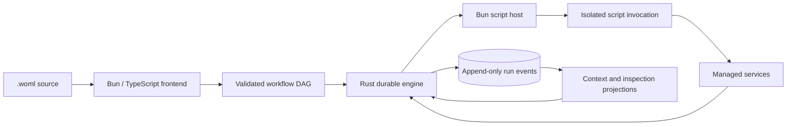

# WOML Product Information

> This document is the product and positioning source for the WOML website.
> It describes the current WOML v1 product honestly. For exact syntax,
> attributes, commands, services, limits, and behavior, use [API Reference](api.md).

## Product name

**WOML — Workflow Orchestration Markup Language**

## Tagline

**If you can read HTML, you can use WOML to automate anything, literally anything.**

## Short description

WOML is an HTML-inspired language and self-hosted runtime for building durable
workflow automation. It combines readable markup for workflow structure with
real JavaScript for business logic, then runs that workflow through a durable
Rust engine and an isolated Bun script host.

## One-paragraph description

WOML lets developers describe triggers, steps, conditions, parallel work,
forked branches, human approvals, lifecycle hooks, and runtime policies in one
readable `.woml` file. JavaScript is written directly inside `<script>` when a
workflow needs real logic. WOML takes responsibility for everything around
that code: durable execution history, retries, idempotent managed operations,
concurrency, timeouts, recovery, secrets, services, observability, and
production operation. Workflows stay understandable in a pull request and can
run locally, on a server, or in a container without a visual canvas or a hosted
automation vendor.

## The story behind WOML

Workflow automation usually forces people toward one of two extremes.

Visual tools make the first workflow easy, but a large canvas can become hard
to navigate, review, reuse, test, and version. Code-first workflow engines are
powerful, but the workflow's shape is often hidden inside framework calls,
builders, decorators, or infrastructure-specific configuration.

WOML started from a simple product question:

> What if a workflow were as readable as an HTML document, but still had the
> power of JavaScript and a durable production engine?

That leads to a deliberate division of responsibility:

- **Markup explains what the workflow is.** Triggers, sequencing, conditions,
  concurrency, approvals, and lifecycle are visible in the document.
- **JavaScript explains what a step does.** Authors can use normal expressions,
  loops, `await`, modules, Fetch, and managed services without inventing a
  configuration language for business logic.
- **The runtime explains what happened.** Rust owns durable run history,
  scheduling, recovery, policies, managed effects, and operator controls.

The result is code-first automation whose structure can be understood by more
than the person who wrote it.

## The core idea

```xml
<woml>
  <workflow
    id="welcome-user"
    name="Welcome User"
    description="Prepare and send a personalized welcome message."
    version="1.0.0"
  >
    <triggers>
      <manual id="start" />
    </triggers>

    <steps>
      <step id="prepare" name="Prepare user">
        <script>
          return { name: context.payload.name ?? "World" };
        </script>
      </step>

      <step id="greet" name="Build greeting">
        <script>
          return { message: `Hello ${context.steps.prepare.name}` };
        </script>
      </step>
    </steps>
  </workflow>
</woml>
```

```bash
woml check welcome-user.woml
woml run welcome-user.woml
```

The file shows the workflow from top to bottom. The first step's JSON return is
durably recorded as `context.steps.prepare`; the second step consumes it.
`woml run` stays active so the manual trigger can create another run whenever
the operator presses Enter.

## What WOML is

WOML is:

- a readable workflow authoring language;
- a compiler from `.woml` source into a language-neutral workflow DAG;
- a durable, event-sourced Rust execution engine;
- an isolated Bun runtime for authored JavaScript;
- a cross-platform command-line product for authoring and operations;
- a local module and reusable-definition system;
- a set of supervised capabilities for external effects; and
- a self-hosted, continuous automation runtime.

WOML is not:

- a visual drag-and-drop canvas;
- a replacement programming language for JavaScript;
- an XML library or strict XML dialect;
- a hosted SaaS platform that owns the user's workflow data;
- a hostile multi-tenant JavaScript sandbox; or
- a promise that every external effect is magically exactly once.

## Why use WOML?

### Read the workflow as a document

The source shows the trigger, business steps, control flow, approval points,
and operational policy without tracing a chain of API calls. Names and
descriptions become part of the terminal experience, so the runtime output uses
the same vocabulary as the source.

### Use real JavaScript without hiding the workflow

JavaScript belongs inside `<script>`, where it can solve the problems code is
good at. It does not need to encode the surrounding workflow structure. Authors
get `context`, `attempt`, `services`, and explicitly referenced `secrets` as
runtime bindings.

### Put automation in Git

A `.woml` file is ordinary text. It produces meaningful diffs, works with pull
requests, can be generated by tools and AI agents, and can be reviewed with the
same process as application code.

### Recover from process restarts

WOML does not treat one in-memory object as the source of truth. The Rust engine
records versioned events, folds them into projections, pins immutable workflow
definitions to runs, and resumes only work whose recovery semantics are safe.

### Keep effects supervised

Managed HTTP, database, storage, cache, durable state, internal events,
workflow calls, and messaging operations cross a reviewed Rust boundary. WOML
records bounded operation outcomes, applies cancellation and limits, and fails
an ambiguous interrupted effect closed instead of pretending it is safe to
replay.

### Own the runtime and data

WOML runs on the user's machine or infrastructure. The default durable
authority is a local SQLite state store. Production deployments can use
foreground supervision, background operation, Docker, systemd, or a
single-pod Kubernetes deployment.

### Operate workflows from the same CLI

The CLI validates, runs, inspects, follows logs, cancels, backs up, restores,
and prunes workflow history. Human output is organized and colored; supported
commands also provide stable JSON for automation.

## Key features

### Authoring

- HTML-inspired `.woml` documents with source-located diagnostics.
- Raw JavaScript inside `<script>` without CDATA or XML escaping.
- Workflow metadata: stable ID, name, description, and author-defined version.
- Automatic VS Code syntax highlighting and generated service/module types.
- Local JavaScript and TypeScript modules exposed through `services.<name>`.
- Reusable WOML steps and custom notification providers with declared props.

### Triggers

- Real keyboard-driven manual triggers.
- Validated HTTP webhooks with optional bearer authentication.
- Five-field cron schedules with IANA timezones and missed-run policies.
- Fixed durable intervals.
- Named internal events and optional authenticated event HTTP ingress.
- Slack Socket Mode messages.
- Telegram messages through long polling.
- Discord mentions and direct messages through the Gateway.
- Signed WhatsApp Cloud API callbacks.

### Control flow

- Sequential steps with explicit output identity.
- Bounded concurrent `<parallel>` groups.
- Boolean `<choose>` routes with predictable merged results.
- Exact-string `<switch>` routing without fallthrough.
- Concurrent multi-step `<fork>` branches with explicit join membership.
- Durable Human Approval with approved, rejected, and timeout behavior.

### Reliability

- Event-sourced run history and immutable definition binding.
- Durable attempts and bounded retry policies on `<step>`.
- Stable operation names and idempotency identities for managed effects.
- Fail-closed crash recovery for ambiguous external effects.
- Workflow concurrency, rolling rate limits, deadlines, and durable queues.
- Durable workflow-owned state with versions and compare-and-set.

### Services

- Bun-native `fetch()` for standard Web API compatibility.
- `services.http.request()` for supervised outbound HTTP.
- `services.db()` for SQLite and PostgreSQL.
- `services.storage` for checksummed durable local objects.
- `services.cache` for expiring workflow-scoped optimization data.
- `services.state` for small permanent workflow-owned JSON values.
- `services.events.emit()` for durable event fan-out.
- `services.workflows.call()` and `.start()` for workflow composition.
- Supervised Telegram, Discord, and WhatsApp messaging.

### Human and system communication

- Approval notifications through Slack, Telegram, Discord, WhatsApp, or local
  custom providers.
- Multiple destinations share one durable first-decision-wins approval.
- Informational lifecycle notifications have no decision authority.
- Provider doctor commands validate credentials and permissions safely.

### Operations

- Long-lived foreground execution and explicit background execution.
- Multi-file and direct-directory deployment.
- Colored terminal runs with step names, descriptions, outputs, and timings.
- Live runtime inspection and durable log following.
- Run listing, redacted inspection, cancellation, and graceful shutdown.
- Coherent backup, guarded restore, history retention, and SQLite compaction.
- Health, readiness, snapshots, SSE updates, structured logs, and Prometheus
  metrics on the local operations surface.
- Native Rust packages for supported Linux, macOS, and Windows targets.

## How WOML works



1. The Bun/TypeScript frontend parses WOML, validates its structure and
   references, and lowers it into a language-neutral DAG.
2. Rust validates that compiled model again and becomes the execution and
   persistence authority.
3. When a script node is ready, Rust sends a bounded invocation to the
   long-lived Bun host, which uses isolated worker contexts per invocation.
4. The script receives context derived from durable history. Its successful
   JSON return becomes the named output of that step.
5. Managed service operations return through Rust so attempts, cancellation,
   limits, safe metadata, and recovery behavior remain observable.

The core never parses WOML, interprets `{{...}}`, understands embedded
JavaScript source, or owns editor behavior. That separation allows future
frontends to target the same model without putting syntax knowledge into the
engine.

## WOML versus alternatives

The comparison is about product shape, not a claim that one tool is best for
every team.

| Tool | How workflows are built | Readable by the whole team | Self-hosted | Logic without a ceiling |
| --- | --- | --- | :---: | :---: |
| **WOML** | **Markup + JavaScript** | ✅ **Clear, document-like structure** | ✅ | ✅ **Inline JavaScript, modules, and services** |
| n8n | Visual canvas | ⚠️ Easy at first; harder as the canvas grows | ✅ | ⚠️ Code and custom nodes |
| Zapier | Visual canvas | ⚠️ Friendly for smaller automations | ❌ | ⚠️ Platform actions and code steps |
| Temporal | Code with language SDKs | ❌ Primarily readable by engineers | ✅ | ✅ Full programming languages |
| AWS Step Functions | JSON/YAML with ASL | ❌ Requires ASL and AWS knowledge | ❌ | ⚠️ Extended through AWS services and functions |
| Apache Airflow | Python DAGs | ❌ Primarily readable by Python/data teams | ✅ | ✅ Python and operators |

WOML's distinctive combination is document-like structure, self-hosted
ownership, and full JavaScript flexibility in the same workflow file.

## Who WOML is for

WOML is a strong fit for:

- developers who want code-first automation without hiding flow in a fluent
  SDK;
- teams that want workflows reviewed in Git;
- AI-agent and automation projects that need readable orchestration around
  LLM or API steps;
- product and operations teams who need engineers and non-engineers to discuss
  the same workflow structure;
- self-hosters who want a durable local runtime rather than a required SaaS;
- applications that need webhooks, schedules, approvals, branching, durable
  state, and service calls in one artifact; and
- tools or AI agents that generate workflows and need a constrained,
  source-validatable format.

## When WOML may not be the right choice

- A purely visual, no-code editor is a hard requirement.
- Untrusted tenants must run arbitrary JavaScript in one shared hostile
  multi-tenant sandbox.
- The deployment requires a managed multi-region control plane today.
- The workflow depends on structural loops, durable for-each, race, batching,
  or first-success primitives that WOML v1 intentionally does not expose.
- The team wants a broad marketplace of prebuilt third-party integrations more
  than it wants local modules and explicit HTTP/API code.

JavaScript can perform local loops and transformations, but that is not the
same as durable per-item structural execution and inspection.

## Trust, security, and honesty

WOML makes several important boundaries explicit:

- Secret values are stored outside source and injected only when statically
  referenced.
- Normal inspection and logs omit payloads, context, outputs, credentials,
  idempotency keys, and provider message bodies.
- Native Fetch is convenient but the local profile is not an SSRF sandbox;
  production deployments should apply network egress policy.
- Bun workers isolate invocations, but WOML v1 is not advertised as a hostile
  multi-tenant sandbox.
- An event log does not make arbitrary side effects exactly once.
- If a process crashes after an effect may have happened but before its result
  is recorded, WOML reports ambiguity and fails closed unless a reviewed
  operation can safely reattach.
- Lifecycle hooks are observers. Anything required for business correctness
  belongs in ordinary workflow steps.

## Current v1 boundaries

WOML v1 deliberately does not include:

- arbitrary graph-edge attributes such as `after` or `depends-on`;
- structural loops, durable for-each, batching, race, or first-success groups;
- declarative database or HTTP operation tags inside `<step>`;
- npm package imports or runtime module installation;
- external schema-file references;
- `context.env`, `context.run`, or secret enumeration;
- a JavaScript `woml.resume()` API;
- long approval-waiting synchronous workflow calls;
- NoSQL document databases or a public `services.queue`; or
- arbitrary structural custom tags.

Unsupported syntax is rejected instead of accepted and silently ignored.

## Product principles

1. **Readable first.** The workflow should be understandable from its source.
2. **Real code where code belongs.** WOML does not invent a weak expression
   language to replace JavaScript.
3. **One durable authority.** Events and the Rust engine own execution truth.
4. **Explicit identities.** Workflow, trigger, step, branch, and operation IDs
   make recovery and inspection predictable.
5. **Fail closed.** WOML does not replay an ambiguous external effect merely
   because a process restarted.
6. **No silent features.** Accepted syntax must have executable semantics.
7. **Simple local experience.** `woml check` and `woml run` remain the primary
   path from source to automation.
8. **Progressive production depth.** The same workflow can move from a terminal
   to supervised deployment without changing languages.

## Suggested website message

The website should lead with the author experience, then reveal the runtime
depth:

1. Show a small workflow that anyone who reads HTML can understand.
2. Show real JavaScript using `context.steps`.
3. Show one visual flow diagram generated from the same source.
4. Show the organized terminal result.
5. Then explain durability, managed services, approvals, and production
   operation.

WOML's “aha” moment is not merely that markup can describe a workflow. It is
that the same readable file can remain useful when the automation becomes
concurrent, stateful, long-running, human-driven, and operationally serious.
