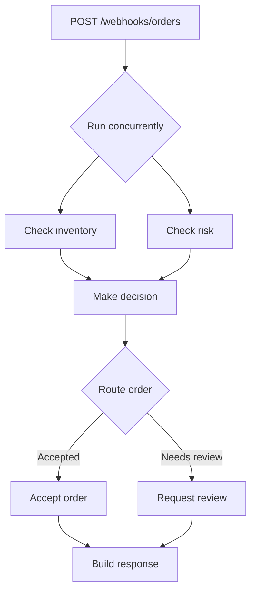

# WOML: Workflow Orchestration Markup Language

WOML is an HTML-inspired language for building and running workflow automation. It keeps triggers, steps, control flow, approvals, lifecycle hooks, and runtime policies in one readable file—then gives every step real JavaScript when markup alone is not enough.

The `woml-cli` package provides the `woml` command, the Bun script runtime, and the native Rust engine selected for your operating system.

## Install

WOML requires [Bun](https://bun.sh/) 1.3.14 or later. Install it globally with your preferred package manager:

```bash
npm install --global woml-cli
```

```bash
bun add --global woml-cli
```

```bash
pnpm add --global woml-cli
```

Verify the installation:

```bash
woml --version
```

Native engines are installed automatically for supported macOS, Linux, and Windows systems. You do not need to install `@woml-org/*` packages directly or configure an external database.

## Quick Start: Route an Order

Save this as `order-router.woml`:

```xml
<woml>
  <workflow
    id="order-router"
    name="Order Router"
    description="Check inventory and risk concurrently, then route the order."
    version="1.0.0"
  >
    <triggers>
      <webhook
        id="newOrder"
        path="/webhooks/orders"
        method="POST"
        auth="none"
      >
        <schema>
          {
            "type": "object",
            "required": ["orderId", "inStock", "riskScore"],
            "properties": {
              "orderId": { "type": "string" },
              "inStock": { "type": "boolean" },
              "riskScore": { "type": "number" }
            },
            "additionalProperties": false
          }
        </schema>
      </webhook>
    </triggers>

    <steps>
      <parallel
        id="orderChecks"
        name="Run order checks"
        description="Check inventory and risk at the same time."
        concurrency="2"
        on-error="wait-all"
      >
        <step id="inventoryCheck" name="Check inventory">
          <script>
            return { available: context.payload.inStock };
          </script>
        </step>

        <step id="riskCheck" name="Check risk">
          <script>
            return {
              approved: context.payload.riskScore < 70,
              score: context.payload.riskScore
            };
          </script>
        </step>
      </parallel>

      <step
        id="canFulfill"
        name="Make decision"
        description="Combine both check results."
      >
        <script>
          return {
            value:
              context.steps.inventoryCheck.available &&
              context.steps.riskCheck.approved
          };
        </script>
      </step>

      <choose id="orderRoute" name="Route order">
        <when test="{{context.steps.canFulfill.value}}">
          <step id="acceptOrder" name="Accept order">
            <script>
              return {
                orderId: context.payload.orderId,
                status: "accepted",
                message: `Order ${context.payload.orderId} is ready for fulfillment.`
              };
            </script>
          </step>
          <result value="{{context.steps.acceptOrder}}" />
        </when>

        <otherwise>
          <step id="reviewOrder" name="Request review">
            <script>
              return {
                orderId: context.payload.orderId,
                status: "review",
                message: `Order ${context.payload.orderId} needs review.`
              };
            </script>
          </step>
          <result value="{{context.steps.reviewOrder}}" />
        </otherwise>
      </choose>

      <step id="response" name="Build response">
        <script>
          return context.steps.orderRoute;
        </script>
      </step>
    </steps>
  </workflow>
</woml>
```

Check and activate it:

```bash
woml check order-router.woml
woml run order-router.woml
```

WOML prints the active webhook URL and a generated `curl` command. Trigger the workflow from another terminal:

```bash
curl --request POST http://127.0.0.1:3000/webhooks/orders \
  --header 'content-type: application/json' \
  --data '{"orderId":"order-42","inStock":true,"riskScore":18}'
```

The request becomes `context.payload`. The two checks run concurrently, `<choose>` selects one route, and every step result is recorded under `context.steps.<id>`.

Use `auth="none"` only for local development. Configure authenticated webhooks before exposing an endpoint outside a trusted environment.

## The Workflow at a Glance



## Why WOML?

- **Readable as a document** — the workflow structure is visible without tracing API calls or navigating a canvas.
- **JavaScript when you need it** — use familiar logic inside `<script>` while WOML supervises the workflow around it.
- **Durable by default** — runs, attempts, waits, decisions, lifecycle events, and outcomes are recorded by the Rust engine.
- **Git-native** — `.woml` files produce meaningful diffs and fit normal review and deployment workflows.
- **Self-hosted** — run locally, on a server, in Docker, or through your own infrastructure.

## Key Features

- Manual, webhook, schedule, interval, internal-event, Slack, Telegram, Discord, and WhatsApp triggers.
- Sequential steps, retries, durable bounded item loops, parallel groups, choices, switches, and multi-step forks with explicit joins.
- Durable human approvals with Slack, Telegram, Discord, WhatsApp, or custom notification providers.
- Workflow and step lifecycle hooks with scripts and notifications.
- Managed HTTP, SQLite/PostgreSQL, storage, cache, state, events, workflow-call, and communication capabilities.
- Native `fetch()` plus Rust-supervised `services.*` operations.
- Local JavaScript/TypeScript modules, reusable WOML steps, and reusable notification providers.
- Runtime concurrency, rate-limit, queue, and timeout policies.
- Foreground and background operation, colored inspection, durable logs, cancellation, backup, restore, and retention.

## Basic WOML API

### Document tags

| Tag | Description |
| --- | --- |
| `<woml>` | Root of every WOML document. It contains imports, a workflow, or reusable definitions. |
| `<imports>` | Declares reusable project dependencies before the workflow. |
| `<module name="..." from="..." />` | Imports a local JavaScript or TypeScript module as `services.<name>`. |
| `<workflow>` | Defines one executable workflow and its identity, name, description, and version. |
| `<config>` | Declares workflow concurrency, rate limit, queue, and timeout policies. |
| `<lifecycle>` | Contains scripts or notifications that observe workflow and step lifecycle events. |
| `<triggers>` | Contains the trigger definitions that can create workflow runs. |
| `<steps>` | Contains the workflow's ordered business flow. |

### Trigger tags

| Tag | Description |
| --- | --- |
| `<manual>` | Keeps the workflow active and creates a run whenever the operator presses Enter. |
| `<webhook>` | Creates a run from a validated HTTP request at a static route. |
| `<schedule>` | Creates runs from a five-field cron schedule and optional timezone. |
| `<interval>` | Creates runs repeatedly using a fixed duration such as `30s` or `5m`. |
| `<event>` | Subscribes to a durable named event emitted internally or through authenticated HTTP. |
| `<slack>` | Receives supported Slack Socket Mode events. |
| `<telegram>` | Receives human text messages through Telegram long polling. |
| `<discord>` | Receives supported Discord mentions and direct messages. |
| `<whatsapp>` | Receives signed WhatsApp Cloud API message callbacks. |

### Steps and control-flow tags

| Tag | Description |
| --- | --- |
| `<step>` | Defines one named executable operation; its return value becomes `context.steps.<id>`. |
| `<script>` | Runs JavaScript with the current `context`, `services`, `secrets`, and `attempt` bindings. |
| `<parallel>` | Runs its direct child steps concurrently and waits for them to finish. |
| `<for-each>` | Runs its body once per array item with durable identity, bounded concurrency, and ordered aggregate results. |
| `<choose>` | Selects the first true `<when>` route or its final `<otherwise>` route. |
| `<when>` / `<otherwise>` | Define the conditional routes inside `<choose>`. |
| `<result>` | Publishes one stable result from a for-each iteration or selected choice, switch, or approval route. |
| `<switch>` | Selects one exact-string `<case>` or its `<default>` route. |
| `<fork>` | Starts several independent, concurrent multi-step branches and joins the selected branches. |
| `<branch>` | Defines one sequential route inside a `<fork>` and may contain several flow items. |
| `<approval>` | Pauses durably until a human approves, rejects, or the configured timeout settles. |
| `<notify>` | Sends approval or lifecycle notifications through configured providers. |
| `<when-approved>` / `<when-rejected>` | Define the two continuations of an approval decision. |

### Lifecycle tags

| Tag | Description |
| --- | --- |
| `<on-start>` | Runs when a workflow run begins. |
| `<on-step-start>` | Runs before matching steps begin; its optional `steps` attribute filters step IDs. |
| `<on-step-success>` | Runs after matching steps succeed. |
| `<on-step-failure>` | Runs after matching steps fail. |
| `<on-step-complete>` | Runs after matching steps reach any terminal outcome. |
| `<on-success>` | Runs after the workflow succeeds. |
| `<on-error>` | Runs after the workflow fails. |
| `<on-cancel>` | Runs after the workflow is cancelled. |
| `<on-complete>` | Runs last after any workflow outcome. |

## Context

`context` is the read-only data available to an ordinary workflow script. It is derived from durable run events rather than treated as an authoritative mutable object.

| Reference | Description |
| --- | --- |
| `context.payload` | The validated input supplied by the trigger or calling workflow. Manual runs currently receive `{}`. |
| `context.steps.<id>` | The JSON-compatible result returned by a completed step or result-producing control item. |
| `context.item` | The current item while a script is running inside `<for-each>`; unavailable outside that loop. |
| `context.iteration.index` | The current `<for-each>` item's stable, zero-based input index. |
| `context.iteration.total` | The total number of items captured by the current `<for-each>`. |

Return only data that later steps genuinely need. Step results become durable workflow context, while local variables and mutations to `context` do not persist.

```javascript
const order = context.payload;
const total = context.steps.calculateTotal.total;

return {
  orderId: order.orderId,
  total
};
```

## Services

`services` contains WOML's supervised capabilities and aliases imported through `<module>`. Managed operations cross the Bun-to-Rust boundary for durable outcomes, cancellation, limits, and recovery.

| Service | Description |
| --- | --- |
| `services.http.request()` | Makes a managed HTTP request with status policy, timeout, limits, cancellation, and durable operation history. |
| `services.db()` | Opens a managed SQLite or PostgreSQL handle for queries, writes, and transactions. |
| `services.storage` | Stores and retrieves larger checksummed objects outside workflow context. |
| `services.cache` | Keeps reusable, expiring optimization data that may be safely discarded. |
| `services.state` | Stores small, versioned workflow-owned values that must survive future runs and restarts. |
| `services.events.emit()` | Publishes a durable named event to every matching active workflow. |
| `services.workflows.call()` | Starts one workflow and waits for its final JSON result. |
| `services.workflows.start()` | Starts one workflow in the background and immediately returns its durable run ID. |
| `services.telegram.send()` | Sends a supervised Telegram message or reply. |
| `services.discord.send()` | Sends a supervised Discord message or reply. |
| `services.whatsapp.send()` | Sends an approved WhatsApp Cloud API template message. |
| `services.<module>` | Exposes named exports from an imported local JavaScript or TypeScript module. |

For standard Web API compatibility and streaming, scripts may also use Bun's native `fetch()`. Prefer `services.http.request()` when the request needs WOML-managed limits, cancellation, operation identity, and durable supervision.

## Common Commands

```bash
woml check workflows/                    # Parse, validate, and compile
woml run workflows/                      # Activate workflows in the foreground
woml run workflows/ --background         # Activate them in the background
woml inspect                             # Open the colored runtime inspector
woml list                                # List workflows and recent runs
woml get run_...                         # Inspect one run and its history
woml cancel run_...                      # Cancel a pending or running workflow
woml workflow-id --logs                  # Follow logs for a workflow
woml secrets set API_TOKEN               # Store a secret securely
woml backup backups/latest               # Back up the durable state store
woml prune --before 30d --dry-run        # Preview retention cleanup
```

Read the complete [CLI reference](https://github.com/dali-benothmen/woml/blob/master/docs/cli-reference.md) for every command and option.

## Build Workflows with AI

The WOML Skill teaches compatible AI coding agents the released language, services, providers, modules, reliability rules, and CLI. Describe the automation you want and the agent can create the `.woml` file, identify required secrets, validate it, and provide the exact command needed to run it.

```text
$woml Build an order-processing workflow that starts from a webhook, checks
inventory and fraud risk concurrently, and asks for approval when risk is high.
```

Install it for Claude Code in the current project:

```bash
mkdir -p .claude/skills/woml
curl -fsSL https://github.com/dali-benothmen/woml/releases/latest/download/woml-skill.tar.gz \
  | tar -xz -C .claude/skills/woml
```

For Codex and other Agent Skills-compatible tools, copy the repository's complete [`skills/woml`](https://github.com/dali-benothmen/woml/tree/master/skills/woml) directory into `.agents/skills/woml`. Review generated scripts, service calls, and filesystem access before running them, and never place real secret values in prompts or workflow files.

## Documentation

- [Getting started](https://github.com/dali-benothmen/woml/blob/master/docs/getting-started.md)
- [Language reference](https://github.com/dali-benothmen/woml/blob/master/docs/language-reference.md)
- [CLI reference](https://github.com/dali-benothmen/woml/blob/master/docs/cli-reference.md)
- [Services and capabilities](https://github.com/dali-benothmen/woml/blob/master/docs/woml-services.md)
- [Modules](https://github.com/dali-benothmen/woml/blob/master/docs/woml-modules.md)
- [Communication providers](https://github.com/dali-benothmen/woml/blob/master/docs/woml-communication-providers.md)
- [Production deployment](https://github.com/dali-benothmen/woml/blob/master/docs/woml-production-deployment.md)

## Support and Security

Use [GitHub Discussions](https://github.com/dali-benothmen/woml/discussions) for questions and [GitHub Issues](https://github.com/dali-benothmen/woml/issues) for reproducible bugs. Report vulnerabilities privately according to the [security policy](https://github.com/dali-benothmen/woml/blob/master/SECURITY.md).

## License

WOML is released under the [Apache License 2.0](https://github.com/dali-benothmen/woml/blob/master/LICENSE).
