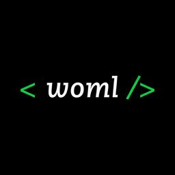

<p align="center">
  
</p>

<h1 align="center">WOML: Workflow Orchestration Markup Language</h1>

<p align="center">
  Build durable workflow automation with readable markup and JavaScript.
</p>

<p align="center">
  <a href="https://github.com/dali-benothmen/woml/">
    
  </a>
  <a href="https://github.com/dali-benothmen/woml/blob/master/LICENSE">
    
  </a>
</p>

WOML (Workflow Orchestration Markup Language) is a markup language for building and running workflow automation. A workflow written in WOML is a document you can read top to bottom — its triggers, steps, control flow, approvals, and lifecycle all expressed as clear, HTML-inspired structure rather than tangled code or an unreadable diagram.

## Key Features

- **Structured workflow markup** — define workflows through semantic elements
  such as `<triggers>`, `<steps>`, `<step>`, `<script>`, and `<lifecycle>`.
- **Flexible automation triggers** — start workflows manually or through
  webhooks, Slack, Telegram, Discord, WhatsApp, schedules, intervals, and
  internal events.
- **Embedded JavaScript** — use the familiar `context` binding to read the
  trigger payload, previous step results, and run information.
- **Durable execution** — runs are supervised by the Rust core and represented
  through versioned events instead of an authoritative mutable context object.
- **Workflow control flow** — compose sequential steps, parallel work,
  conditional choices, switches, and forked branches with explicit joins.
- **Retries and idempotency** — declare retry behavior with the `retry`
  attribute while WOML preserves durable attempt history and safe execution
  boundaries.
- **Human-in-the-loop automation** — pause a workflow for approval, notify
  reviewers, and continue through approved or rejected routes.
- **Built-in capabilities** — access HTTP, SQL databases, storage, cache,
  events, durable state, and other workflows through `services`.
- **Reusable building blocks** — import JavaScript or TypeScript modules and
  define reusable WOML steps and notification providers.
- **Production operation** — apply concurrency, rate-limit, timeout, queue,
  and durable-state policies; run automations in the background and inspect
  their durable logs.
- **Native VS Code experience** — get HTML-style WOML markup, embedded
  JavaScript highlighting, visible runtime bindings, reference-expression
  highlighting, snippets, and a dedicated `.woml` file icon.

## Quick Start

Create a file named `hello.woml`:

```xml
<woml>
  <workflow
    id="hello-workflow"
    name="Hello workflow"
    description="Build a personalized greeting"
    version="1.0.0"
  >
    <triggers>
      <manual id="start" />
    </triggers>

    <steps>
      <step
        id="person"
        name="Prepare person"
        description="Create the person used by the next step."
      >
        <script>
          return {
            name: "Dali"
          };
        </script>
      </step>

      <step
        id="greeting"
        name="Build greeting"
        description="Build the final message from the previous result."
      >
        <script>
          return {
            message: `Hello ${context.steps.person.name}`
          };
        </script>
      </step>
    </steps>
  </workflow>
</woml>
```

Run it with:

```bash
woml run hello.woml
```

The manual trigger keeps the automation active. Press <kbd>Enter</kbd> to
start a run, and WOML executes both steps in order. The second step reads the
first step's result through `context.steps.person` and returns:

```json
{
  "message": "Hello Dali"
}
```

## WOML Runtime Bindings

WOML provides a small set of explicit bindings inside scripts and reference
expressions:

| Binding     | Purpose                                                                 |
| ----------- | ----------------------------------------------------------------------- |
| `context`   | Access the trigger payload, completed step results, and run information |
| `services`  | Use built-in and imported workflow capabilities                         |
| `secrets`   | Read secrets configured for the workflow runtime                        |
| `props`     | Receive values passed to a reusable WOML definition                     |
| `lifecycle` | Read lifecycle outcome and failure information inside hooks             |
| `attempt`   | Read retry-attempt information for the current operation                |

Reference expressions use the same roots inside WOML attributes:

```xml
message="Order total: {{context.steps.calculateTotal.total}}"
```

## Visual Studio Code Experience

WOML follows the active editor theme rather than introducing a separate color
theme:

- WOML elements use the same scopes as HTML elements.
- Code inside `<script>` uses native JavaScript highlighting.
- Runtime bindings remain visually distinct from ordinary variables.
- `{{...}}` expressions are highlighted inside attribute values.
- `.woml` files receive a dedicated file icon.

Provider and workflow snippets are available:

| Prefix          | Creates                                                  |
| --------------- | -------------------------------------------------------- |
| `woml-workflow` | A complete workflow with a manual trigger and first step |
| `woml-step`     | A named script step with an optional description         |
| `woml-telegram-trigger` | A Telegram message trigger |
| `woml-telegram-send` | A supervised Telegram reply |
| `woml-telegram-notify` | A Telegram notification destination |
| `woml-discord-trigger` | A Discord mention/direct-message trigger |
| `woml-discord-send` | A supervised Discord reply |
| `woml-discord-notify` | A Discord notification destination |
| `woml-whatsapp-trigger` | A signed WhatsApp message trigger |
| `woml-whatsapp-send` | An approved WhatsApp template send |
| `woml-whatsapp-notify` | A WhatsApp notification destination |

## Documentation

For WOML syntax, workflow execution, triggers, control flow, approvals,
services, modules, runtime policies, durable state, and production operations,
visit the [WOML documentation](https://github.com/dali-benothmen/woml/).

## License

WOML is available under the
[Apache License 2.0](https://github.com/dali-benothmen/woml/blob/master/LICENSE).
